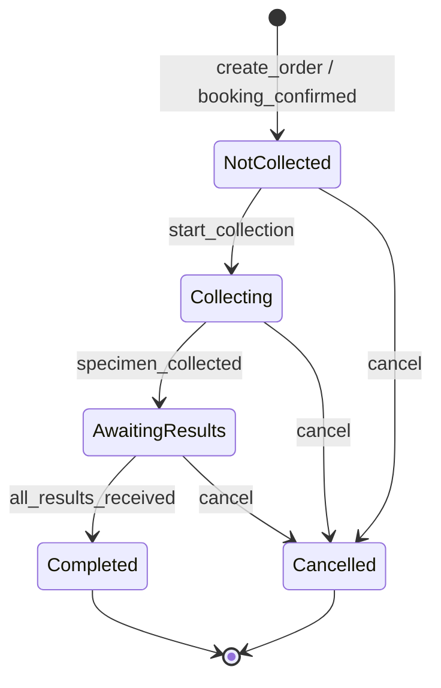
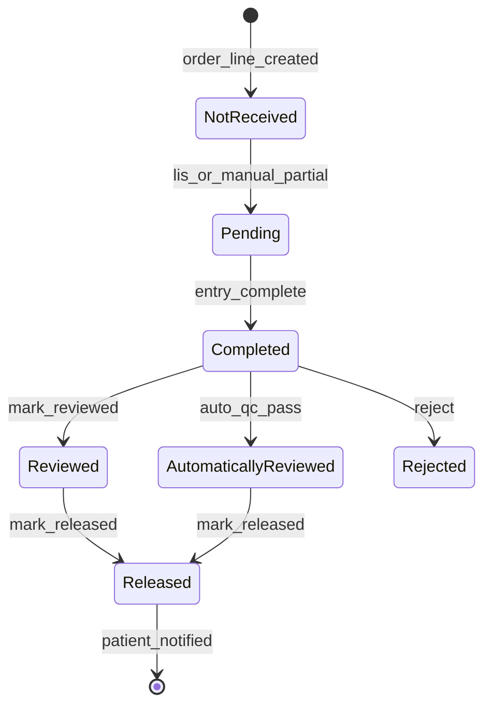
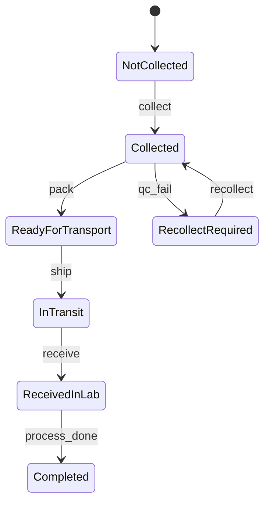

# OptiSchedule — Product Roadmap

Gap analysis vs. production-ready platforms (e.g. Alteg.io).  
Goal: **bookings + reminders + payments + staff schedule + reports** for salon/service businesses.

Status: `[ ]` todo · `[~]` in progress · `[x]` done

**Build policy:** Ship **product features** first → **launch & consumer app** → **lifecycle & ops** → **AI expansion** → **onboarding, pricing & Stripe plans last**. Existing AI baseline stays.

---

## Sprint overview

~2-week sprints. Features **1–8** → Gift cards **9** → Launch & consumer **10–11** → Lifecycle & ops **12–13** → AI **14–25** → Monetization **26–27**.

| Sprint | Theme | IDs |
|--------|--------|-----|
| **1** | Mobile push & offline | gap-2.1, gap-2.3 |
| **2** | Integrations — webhooks & Zapier | gap-4.3, gap-4.4, gap-4.5 |
| **3** | Integrations — accounting & support | gap-4.1, gap-4.2 |
| **4** | In-app polish | gap-6.4, gap-6.5 |
| **5** | Scheduling vertical depth | gap-8.2, **sub-1**, **gap-8.3**, **gap-8.7** |
| **6** | Growth & vertical playbooks | gap-8.1, gap-8.5 |
| **7** | Retail POS & enterprise trust | gap-8.4, gap-5.4, gap-5.5 |
| **8** | Strategy & compliance eval | gap-5.6, gap-1.6 |
| **—** | Postgres RLS tenant isolation | **gap-5.7** |
| **9** | Customer gift card purchase & delivery | **gc-1** |
| **10** | Launch — billing & provider app store | gap-7.5, gap-7.6, gap-1.5 |
| **11** | Consumer booking app | **gap-2.5** |
| **12** | Marketing alerts & subscription accounting | gap-4.6, gap-4.7 |
| **13** | Customer booking self-service & staff push | gap-2.7, gap-2.8, **pay-2** |
| **14** | AI reliability & regression ✅ | gap-3.2, gap-3.7, gap-3.1 |
| **15** | AI platform & limits ✅ | ai-0.1, ai-0.2, ai-0.10, gap-3.3, ai-i10 |
| **16** | AI dashboard UX core | ai-d4, ai-d22, ai-d7, ai-d3 |
| **17** | AI dashboard depth | ai-d5, ai-d6, ai-d10, ai-d11, ai-d18, ai-d19 |
| **18** | AI page coverage & onboarding | ai-d21, ai-d24, ai-d25, gap-6.3, gap-6.6, gap-8.6 |
| **19** | AI mobile commands | ai-m3, ai-m6, ai-m8, ai-m9, ai-m11, ai-m13 |
| **20** | AI mobile push & voice | ai-m5, ai-m16, ai-m17, ai-m19, gap-2.2, gap-2.4, gap-2.6 |
| **21** | AI mobile offline | ai-m20, ai-m21, ai-m22 |
| **22** | AI intelligence layer | ai-i2, ai-i3, ai-i6, ai-i8 |
| **23** | AI scheduling scenarios | ai-s2, ai-s3, ai-s4, ai-s5, ai-s6 |
| **24** | AI booking & business ops | ai-b3, ai-b4, ai-b5, ai-o1–ai-o5 |
| **25** | AI enterprise & analytics | ai-e1, ai-e3–ai-e8, gap-3.5 |
| **—** | AI product commands — Sprints 1–13 coverage (planned) | **ai-cmd-0**, **ai-cmd-b1**–**ai-cmd-n1** (~270 intents) |
| **—** | AI command handlers & NLU quality (ongoing) | **ai-cmd-h1**–**ai-cmd-h4** |
| **26** | Onboarding & pricing UX | gap-6.1, gap-7.4 |
| **27** | Stripe plans & seats | gap-7.1, gap-7.2, gap-7.3, gap-5.2, gap-6.2 |
| **28** | Multi-currency support (core v1 shipped) | **curr-1** ✅, **ai-cmd-curr** |
| **29** | Per-tenant language enablement (core v1 shipped) | **lang-1**, **ai-cmd-lang** |
| **30** | Tours vertical (core v1 shipped) | **vert-tour-1**, **ai-cmd-tour** |
| **31** | Clinic vertical (core v1 shipped) | **vert-clinic-1**, **ai-cmd-clinic** |
| **32** | Post-checkout product recommendations (core v1 shipped) | **rec-1**, **ai-cmd-rec** |
| **33** | Ameria payment integration | **pay-ameria-1** |
| **34** | Date format settings (admin-controlled, all apps) (core v1 shipped) | **fmt-1**, **ai-cmd-fmt** |
| **35** | Additional payment gateways — PayPal, Tap, Payme, Wise | **pay-ext-1** |
| **36** | Tax / VAT configuration (core v1 shipped) | **tax-1**, **ai-cmd-tax** |
| **37** | GDPR & HIPAA compliance hardening (core v1 shipped) | **compliance-1**, **ai-cmd-compliance** |
| **38** | AI accuracy — telemetry & measurement | **acc-1** |
| **39** | AI accuracy — eval set expansion & CI gate | **acc-2** |
| **40** | AI accuracy — classification engine + semantic intent matching | **acc-3** |
| **41** | AI accuracy — smart clarification & disambiguation | **acc-4** |
| **42** | AI accuracy — execution verification & rollback | **acc-5** |
| **43** | AI accuracy — continuous learning & escalation | **acc-6** |
| **44** | Apps adoption — telemetry & funnel measurement | **adopt-1** |
| **45** | Apps adoption — acquisition & install funnel | **adopt-2** |
| **46** | Apps adoption — activation & onboarding | **adopt-3** |
| **47** | Apps adoption — retention & re-engagement | **adopt-4** |
| **48** | Apps adoption — performance, reliability & trust | **adopt-5** |
| **49** | Apps adoption — growth loops, habit & exit criteria | **adopt-6** |
| **50** | Near-99%: clarify → success on next turn | **n99-1** |
| **51** | Near-99%: no-clarify completion rate | **n99-2** |
| **52** | Near-99%: install → activation (≤ 7d) | **n99-3** |
| **53** | Near-99%: push opt-in / reachability | **n99-4** |
| **54** | Clinic vertical v2 — lab catalog, orders, results, light EMR | **vert-clinic-2**, **ai-cmd-clinic-v2**, **i18n-clinic-v2** |
| **55** | AI feature parity — inventory & per-role coverage matrix | **parity-1** |
| **56** | AI feature parity — close coverage gaps to 100% per role | **parity-2** |
| **57** | AI feature parity — role-scoped "do anything" agent | **parity-3** |
| **58** | AI feature parity — coverage CI gate & maintenance | **parity-4** |

---

## PostgreSQL RLS — tenant isolation (defense in depth)

**Goal:** Complement application-level `businessId` checks with Postgres row-level security so a missed filter cannot leak cross-tenant data.

Today isolation is app-layer only: `ensureMember()` + explicit `business_id` in queries. RLS adds a second enforcement boundary at the database.

- [ ] **gap-5.7** — PostgreSQL row-level security (RLS) for multi-tenant isolation
- [ ] **gap-5.7.1** — Request middleware — resolve tenant id (`businessId`) from JWT, API key, or public-booking slug; attach to request context before handlers run
- [ ] **gap-5.7.2** — Connection pool session — per request, set tenant on the DB connection (e.g. `SET LOCAL app.current_tenant_id = …` via TypeORM query runner / pool hook) so all queries in that request inherit the tenant context
- [ ] **gap-5.7.3** — RLS policies on tenant-scoped tables — enable RLS + `USING (business_id = current_setting('app.current_tenant_id', true)::uuid)` on tables that carry `business_id` (bookings, customers, employees, services, schedules, gift cards, etc.); skip global tables (`users`, `businesses`)
- [ ] **gap-5.7.4** — Migration / admin bypass — dedicated DB role with `BYPASSRLS` for migrations, cron, and background jobs that legitimately operate across tenants
- [ ] **gap-5.7.5** — Tests — integration specs proving cross-tenant SELECT/UPDATE/DELETE fails at the database layer when RLS is enabled

---

#### Store launch (consumer)

- [ ] **gap-2.5.10** — Consumer app App Store / Play Store listing (separate from provider app **gap-1.5**) — copy + export in `consumer-app/store-listings/`; run `npm run store-listings:export`

*(Integrates **sub-1** subscriptions — one-time vs plan picker, My subscriptions profile.)*


## Sprint 26 — Onboarding & pricing UX

**Goal:** Streamlined first-run setup and public pricing once product, consumer app, and AI are ready.

- [ ] **gap-6.1** — Simplified “first 30 minutes” onboarding — book link live in ≤3 steps
- [ ] **gap-7.4** — Public pricing page with seat calculator + feature comparison matrix

---

## Sprint 27 — Stripe plans & seats

**Goal:** Solo / Starter / Growth / Business tiers live in Stripe; entitlements and tier-gated UI.

- [ ] **gap-7.1** — Implement Solo / Starter / Growth / Business tiers in `plans.ts` + Stripe
- [ ] **gap-7.2** — Per-seat billing (provider + admin seats) with enforcement on employee create / invite
- [ ] **gap-7.3** — Freemium Solo tier — 1 provider, capped AI, no Stripe Connect
- [ ] **gap-5.2** — Implement `PlanLimits` entitlements in API + UI (see `backend/docs/PLANS.md`)
- [ ] **gap-6.2** — Hide advanced modules (AI Ops, monetization, integrations) until Starter+ or explicit enable
- [ ] **gap-1.5** — App Store / Play Store listings for provider app and consumer app with screenshots + reviews flow

---

in the end when I will have many clients:
create Full marketplace per country
Central place where clients discover and book across tenants

- [x] **ai-cmd-tour-1** — Dashboard: **`configure_tour_service`** — "Mark City Tour as a tour with max 12 people", "Set difficulty to moderate for the mountain trek"
- [x] **ai-cmd-tour-2** — Dashboard: **`explain_tour_services`** (READ) — list tour services, group sizes, cover images, upcoming tour bookings with pax / `tourStartDate`–`tourEndDate`
- [x] **ai-cmd-tour-3** — Dashboard: **`apply_tour_playbook`** — shortcut to apply tour vertical playbook (catalog + 08:00–18:00 schedule) for `tour_operator` tenants
- [x] **ai-cmd-tour-4** — Classifier rules + eval cases in `ai-command-eval.cases.ts` for tour configuration and explain phrasing (EN/HY/RU)
- [x] **ai-cmd-tour-5** — Customer/public: **`explain_tour_booking`** — READ when user asks about group size, per-person pricing, or tour duration on booking page
- [x] **ai-cmd-tour-6** — Customer/public: **`explain_tour_day_slots`** (READ) — why multi-day tours show one departure per day, `remainingSpots`, and when a date is fully booked (links **vert-tour-1.6** deferred date-only picker)
- [x] **ai-cmd-tour-7** — Dashboard: **`explain_tour_booking_record`** (READ) — `paxCount`, `tourStartDate`, `tourEndDate`, special requirements on a booking; link provider calendar tour spans (**vert-tour-1.10** shipped)
- [x] **ai-cmd-tour-8** — Dashboard: **`list_upcoming_tour_departures`** (READ) — summarize confirmed tour bookings by departure date, pax, and remaining capacity
- [x] **ai-cmd-tour-9** — Customer/public: **`diagnose_tour_capacity`** (READ) — why checkout rejected pax count or date (max group, fully booked, clamped pax)
- [x] **ai-cmd-tour-10** — Classifier rules + eval cases for day-level slots, tour booking metadata, and capacity phrasing (EN/HY/RU)
- [x] **ai-cmd-tour-11** — Dashboard: **`explain_tour_calendar_span`** (READ) — why a tour appears across multiple days on the provider calendar, service colors, clipped weeks, stacked departures (**vert-tour-1.10**)
- [x] **ai-cmd-tour-12** — Dashboard: **`list_tour_calendar_week`** (READ) — summarize tour departures visible in the current calendar week for a provider (dates, pax, service)
- [x] **ai-cmd-tour-13** — Classifier rules + eval cases for tour calendar span phrasing and week-navigation intents (EN/HY/RU)

**Depends on:** **ai-cmd-h1** classifier parity; registry entry in `ai-command-registry.build.ts` when implemented.

---

## Sprint 31 — Clinic vertical v1 (shipped)

Business types, service metadata, playbook, checkout symptoms/referral, Results tab gating. Deferred lab/results UI → **Sprint 54** (**vert-clinic-2**).

### vert-clinic-1.3 — Lab / test results (deferred → vert-clinic-2.4)
- [x] **vert-clinic-1.5** — ~~DB schema — `patient_test_results` table~~ **superseded by vert-clinic-2.4** — structured `clinic_test_results` + legacy booking-metadata bridge (`legacy-booking-patient-test-results-phi.util.ts`); no separate upload table
- [x] **vert-clinic-1.6** — ~~Result upload API~~ **superseded by vert-clinic-2.4** — structured result entry/release via dashboard/LIS; legacy metadata read-only
- [x] **vert-clinic-1.7** — Dashboard booking detail Results tab — v1: `BookingLabResultsSection` + `ResultsActionHistoryModal`, result transitions + audit history
- [x] **vert-clinic-1.8** — Customer My results in public account — v1: `PublicMyResultsSection` on `/book/:slug/account`, `GET .../me/clinic-test-results` (released only), gated by `businessType`
- [x] **vert-clinic-1.9** — Consumer app My results tab — v1: `MyResultsPage` + bottom tab on clinic vertical, `GET .../me/clinic-test-results`
- [x] **vert-clinic-1.10** — Provider app results tab (assigned patients)
- [x] **vert-clinic-1.11** — Result ready notification
- [x] **vert-clinic-1.12** — Privacy guard for results API — v1: PHI decrypt/mask on `GET .../bookings/:id/results` + `GET .../results/:id`, write audit on transitions, measurement read audit

### vert-clinic-1.4 — Clinic-only UI gating
- [x] **vert-clinic-1.13** — Results tab gating by `businessType` — `shouldShowPatientResultsTab` / `isClinicVerticalBusinessType` in `clinic-service` utils (EN+BE); booking-detail Results tab UI ships with **vert-clinic-1.7**
- [x] **vert-clinic-1.14** — Clinic booking form — optional `referralNotes` and `symptoms` on public checkout for clinic services; stored in booking metadata

**Tests (Sprint 31):**
```bash
cd backend && npm run test:sprint31
cd frontend && npm run test:sprint31
```
- Backend unit: `clinic-service.util.spec.ts` (100% util coverage)
- Backend unit: `vertical-playbooks.constants.spec.ts` (polyclinic/clinic mapping, extended playbook)
- Backend unit: `service.clinic.spec.ts` (create/update clinic metadata, tour/clinic switch)
- Backend integration: `onboarding-vertical-playbook.spec.ts` (clinic/polyclinic preview, catalog metadata)
- Backend integration: `public-booking-clinic.integration.spec.ts` (service mapping, referral/symptoms metadata, trim/omit, non-clinic guard, disabled booking)
- Frontend unit: `clinic-service.spec.ts` (100% util coverage)
- Frontend integration: `clinic-booking.integration.spec.ts` (clinic vs standard services, badges, fasting/prep, checkout payloads)

### vert-clinic-1.5 — AI commands (planned — link to **ai-cmd-h** / implement later)

- [x] **ai-cmd-clinic-1** — Dashboard: **`configure_clinic_service`** — "Mark CBC as a lab test requiring fasting", "Set lipid panel prep instructions"
- [x] **ai-cmd-clinic-2** — Dashboard: **`explain_clinic_services`** (READ) — departments, consultation vs lab vs procedure counts, fasting requirements
- [x] **ai-cmd-clinic-3** — Dashboard: **`apply_clinic_playbook`** — shortcut to apply clinic vertical playbook for `clinic` / `polyclinic` tenants
- [x] **ai-cmd-clinic-4** — Classifier rules + eval cases in `ai-command-eval.cases.ts` for clinic configuration and explain phrasing (EN/HY/RU)
- [x] **ai-cmd-clinic-5** — Customer/public: **`explain_clinic_booking`** — READ when user asks about symptoms/referral fields or lab prep on booking page
- [ ] **ai-cmd-clinic-6** — Dashboard: **`upload_patient_result`** / **`explain_patient_results`** — legacy file-upload path; **superseded for v2** by **`enter_test_result`** / **`release_test_result`** (**ai-cmd-clinic-v2-2**); keep open only if legacy metadata upload is still required

**Depends on:** **ai-cmd-h1** classifier parity; registry entry in `ai-command-registry.build.ts` when implemented.

---

## Sprint 54 — Clinic vertical v2 (generic clinic — lab, results, light EMR)

**Design principle — generic clinic only, zero fertility product logic.**

Booking's clinic vertical is for **any medical clinic**: GP, polyclinic, dental, beauty clinic, outpatient lab, cardiology desk — **not** IVF, cryo, stim sheets, partner cycles, or reproductive journey workflows. The local `clinic-app/` reference is **Pollin (fertility)** code we **mine and strip**, not a product spec. Every clone step must pass a de-fertility review before merge.

**In scope (generic):**

| Domain | Examples |
|--------|----------|
| **Catalog** | CBC, lipid panel, thyroid, ECG, consultation, procedure — tenant-defined test types + panels |
| **Orders** | Lab order on booking; status: not collected → collecting → awaiting results → completed / cancelled |
| **Results** | Structured measurements + PDF; review → release to patient; normal/abnormal flags |
| **Specimens** | Collection, storage, transport between sites |
| **Chart (light EMR)** | Allergies, problems, encounters, staff notes, documents — **one** patient profile (no sex-split fertility fields) |
| **Intake** | Pre-visit questionnaire; symptoms/referral (extends vert-clinic-1 checkout fields) |

**Out of scope — do not ship, do not clone, delete if found in copied files:**

IVF lab · cryo inventory · treatment plans · stim sheets · FertilityIQ · genetic tests tied to embryos · sperm cryo · OB/OHSS/follicle ultrasound modules · partner invitation · patient milestones · IC fertility worksheets · `patientPlanId` on orders · `HormoneType` / `fertilityIQImageURL` on test types · order wizard tied to plan milestones · sex-specific `patient_detail_female/male` · gynaecological/fertility history APIs

**Goal:** Extend **vert-clinic-1** into the generic clinic vertical above on all applicable surfaces (dashboard, provider mobile, customer mobile, public booking).

**Reference app:** `clinic-app/` (gitignored Pollin monorepo). Booking already mirrors scheduling — see **Already ported**. Sprint 54 clones **de-fertility-filtered** lab + EMR slices only.

### Already ported from clinic-app — do not re-copy

| Pattern | Booking location | clinic-app source |
|---------|------------------|-------------------|
| Applied scheduling periods + 10-min micro-slots | `schedule/entities/scheduling-period.entity.ts`, `scheduling-slot.entity.ts` | `scheduling/AppliedSchedulingTemplatePeriod`, `SchedulingSlot` |
| Slot locking on booking create | `booking/booking.service.ts` (lock all micro-slots in window) | Same counting/locking logic |
| Slot lookup by provider + service + dates | `booking.service.ts` `findSlotsByServiceTypeProviderAndDates` comment | `findSlotsByServiceTypeProviderAndDates` |
| Post-booking domain event alias | `events/event-types.ts` `APPOINTMENT_CREATED`, `booking-created.listener.ts` | `publishAppointmentsCreated` |
| PHI encryption + minimum-necessary masking | `phi-encryption.util.ts`, `phi-minimum-access.util.ts`, `compliance/` | Scattered PHI handling |
| HIPAA mode, BAA, session timeout, PHI read audit | `compliance-1` module | Compliance docs (narrower in Booking) |
| Notifications spine (email/SMS/WhatsApp/push) | `notifications.service.ts`, template defaults | Appointment comms — **extend** for `result_ready`, don't duplicate |
| Customer + Booking spine | `customer/`, `booking/` | `patient` + `appointment` — bridge via `customerId` + `bookingId` |
| Employee roles | `MemberRole` on business members | `Staff` + `PermissionEnum` — map, don't import entity |
| Workflow / AI automation | `engine/workflow/`, LangGraph agents | **Separate** from clinic `Task` entity |

### Clinic-app audit — copy vs skip (Tier A–E)

| Tier | Copy / adapt (general clinic) | clinic-app reference | Skip (fertility-only) |
|------|------------------------------|----------------------|------------------------|
| **A — Lab core** | Test type + panel catalog, normal ranges, observation types | `clinic-backend/libs/data-layer/src/apps/clinic-test/` (`test-type`, `test-panel`, enums) | Hormone types, fertility IQ result links, thyroid protocol worksheets |
| **A — Lab core** | Test order lifecycle (`NotCollected` → `Completed`) linked to **Booking** | `apps/clinic-test-results/src/order/` | Patient-plan / cohort order triggers |
| **A — Lab core** | Structured test results + review/release workflow | `apps/clinic-test-results/src/test-result/`, `enums/test-result.enum.ts` | OB/OHSS ultrasound measurements, egg-freezing reports |
| **A — Lab core** | Specimen collection, storage, transport | `apps/clinic-test-results/src/specimen/`, `transport/` | — |
| **A — Lab core** | Patient results list + profile config | `profile-test-result/`, `clinic-frontend/.../patient-emr/.../results/` | Sex-specific fertility profile slots |
| **B — Light EMR** | Patient detail (allergies, problems, demographics) | `apps/emr/src/patient/`, `patient-detail.entity.ts` | `patient_detail_female/male`, pregnancy/GTPAL histories |
| **B — Light EMR** | Encounters + staff notes | `apps/emr/src/encounter/`, `staff-note/` | Stim-sheet / plan encounter types |
| **B — Light EMR** | Documents (upload, categories) | `apps/emr/src/documents/` | — |
| **B — Light EMR** | General medical background | `medical-background/services/general-health.service.ts` | Gynaecological / fertility history endpoints |
| **C — Rx (later)** | Medications + prescriptions | `apps/emr/src/medications/`, `prescriptions/` | — |
| **D — Catalog** | Service category ≈ department; link test types to bookable services | `scheduling/service-category`, `test-type` ↔ `service_type` | — |
| **E — LIS (later)** | Lab sync, machines, background workers | `lab-sync-*`, `apps/lis-background/` | — |
| **—** | IVF lab, cryo, treatment plans | — | `clinic-ivf-lab/`, `clinic-cryo-preservation-lab/`, `emr/plans/`, `stim-sheet/`, frontend `ivf-dashboard/`, `egg-embryo/` |

### Extended reuse beyond Tier A–E (high-value additions)

| Tier | What to reuse | clinic-app reference | Notes |
|------|---------------|----------------------|-------|
| **F — Result entry depth** | **Test observation types** (string/dropdown/textarea fields per test) | `test-observation-type.entity.ts`, `enums/test-observation.enum.ts` | Enables CBC-style structured entry, not PDF-only |
| **F** | **Normal ranges** on test types | `test-type-normal-range.entity.ts`, `test-type-range.entity.ts` | Playbook seeds CBC/lipid; ranges drive abnormal flags |
| **F** | **Review / release action service** + patient-visible status | `test-result/services/test-result-action.service.ts` (`markAsReviewed`, `markAsReleased`) | Wire to Booking `events/` + `notify_patient_result_ready` (clinic uses PubSub + portal `New` state, not a dedicated email enum) |
| **F** | **Result + order change history** (staff audit, not PHI read audit) | `audit-trail/.../patient-order-and-result-audit-trail.service.ts`, `result-history.service.ts`, `test-result-status-history.service.ts` | Complements existing `phi-access-audit.service.ts` |
| **F** | **Order comments, cancel reasons, status history** | `test-order-comment.entity.ts`, `test-order-cancellation-reason.entity.ts`, `test-order-status-history.entity.ts` | Low fertility contamination |
| **F** | **Status UI metadata** (labels, colors, non-editable guards) | `services-common/src/enums/clinic-test.enum.ts` (`NotEditableStatuses`, `CompleteStatuses`, badge colors) | Port constants, not MUI |
| **F** | **Generic attachments + final report status** | `test-result-attachment.service.ts`, `FinalReportStatus` | Skip OB/OHSS/final-report imaging modules |
| **G — Intake & forms** | **Questionnaire engine** (revision, questions, constraints) | `data-layer/.../questionnaires/`, `apps/emr/src/questionnaire/`, `common/helpers/questionnaire.helper.ts` | **Strip** `QuestionnaireJourneyMilestone` / plan coupling |
| **G** | **Pre-visit intake** (structured, beyond checkout symptoms) | `apps/emr/src/intake-form/services/intake-form.service.ts`, frontend `layout/IntakeForm/` | Functional spec: `functional-tests/.../intake-form/` |
| **G** | **Patient alerts banner** ("new results", intake incomplete) | `PatientAlertType` in `services-common/enums/patient.enum.ts`, `PatientHighlightsView/` | Add `TestResultReleased` alert type in Booking |
| **G** | **Clinical consents** (e-sign packages) | `apps/emr/src/consents/` | **Later** — drop plan-linked packages; ≠ cookie consent |
| **H — Staff ops** | **Task entity** (assignee, due, links to order/result/encounter) | `clinic-tasks/entities/task.entity.ts`, `apps/core/src/tasks/` | **Skip** IVF automated task types (`AutomatedTaskType` egg-thaw/plan); keep generic (`HighPriorityResultReview`, `PatientCallback`) |
| **H** | **External / referring doctors** | `apps/emr/src/external-doctors/` | Useful for polyclinic referrals |
| **H** | **Barcode specimen labels** | `clinic-frontend/src/components/BwipJS/` | Small UI port for lab ops |
| **I — Frontend UX shells** (adapt to Booking stack — no Redux/MUI clone) | **Patient EMR tab shell** (permission-gated) | `pages/patient-emr/details/[id]/index.tsx`, `helpers/constants.ts` | Tabs: profile, encounters, results, orders, documents, staff-notes, intake — **skip** plans, ic-form, medications initially |
| **I** | **Results entry form + action history modal** | `components/Results/`, `Modals/ResultsActionHistoryModal/` | Drop `TestResultDetails/FertilityIQ/` |
| **I** | **Orders list/create** (simplified) | `components/Orders/` | Drop `MilestoneGeneration`, super-type IVF wizard |
| **I** | **Encounters / staff notes / documents layouts** | `layout/EncountersLayout/`, `StaffNotesLayout/`, `pages/.../documents/` | Tier B backend + these UX references |
| **I** | **API manager shapes** (not Redux) | `manager/results/resultsManager.ts`, `patientEmr/patientEmrManager.ts` | Replicate DTO/route shapes in Booking hooks |
| **J — Billing pattern (later)** | **Diagnostic / procedure code catalog** (region-agnostic) | `mdbilling-diagnostic-code.entity.ts`, `service-type-to-service-code.entity.ts` | **Skip** OHIP/MDBilling Canada integration; abstract to tenant `clinic_diagnostic_codes` |
| **J** | **After-visit summary** document | `scheduling/entities/after-visit-summary.entity.ts` | Post-consultation summary PDF |
| **K — Skip entirely** | Genetic tests (cryo-linked biopsy IDs), diagnostic imaging OB/OHSS, FertilityIQ, OHIF viewer, partner invitation, patient milestones, IC fertility worksheet | `genetic-tests/`, `diagnostic-imaging/`, `fertility-iq/`, `ObservationType` enum | Pattern-only: generic imaging = PDF attachment |

**Fertility contamination quick rule:** Low = copy entity/enums as-is. Medium = **strip** milestone/plan/sex-specific fields before merge. High = **skip module entirely**. If a PR adds `patientPlanId`, `HormoneType`, or plan/milestone imports → reject.

### De-fertility checklist (apply to every cloned file)

| Strip from cloned code | Replace with (generic) |
|------------------------|---------------------------|
| `patientPlanId`, `PatientPlan`, plan repositories | Order linked to **`bookingId`** + **`customerId`** only |
| `order-view-state` super-type / milestone wizard (`getSuperTypesOrderViewState`, `LibraryContent`) | Simple order CRUD + line items from catalog (**skip `OrderViewStateService` v2**; keep `order-crud`, `order-list`, `order-actions`) |
| `plan-test-result.service.ts`, fertility profile slots | `profile-test-result` pinned to released CBC/lipid/etc. — no plan triggers |
| `HormoneType`, `fertilityIQImageURL`, `PatientPlanToTestTypeProcedure` on `test_type` | Drop columns; optional `metadata` JSON for tenant extensions |
| `PatientPlanRepository` in `test-result.module.ts` | Remove provider |
| OB/OHSS/ovary/uterus result repos + entities | PDF **`test-result-attachment`** only for imaging |
| `GestationalAgeEnum`, reproductive observation types | Generic string/number observations (`test-observation-type`) |
| `mostResponsiblePhysician` from fertility journey | Optional **`referringProviderId`** → external doctors registry (**2.5.8**) |
| Pollin `Patient` + journey types | Booking **`Customer`** + **`patient_clinical_profiles`** (single profile) |
| Frontend tabs: plans, ic-form, FertilityIQ result details | EMR tabs: profile · encounters · results · orders · documents · intake only |

**Files in clone folders that need explicit surgery (grep before merge):**  
`order/order.module.ts`, `order/services/order-view-state.service.ts`, `order/helper/order-view-state.helper.ts`, `order/services/order.service.ts`, `order/services/order-crud.service.ts`, `test-result/test-result.module.ts`, `test-result/helper/test-result.helper.ts`, `profile-test-result/services/plan-test-result.service.ts` (**delete**), `profile-test-result.module.ts`.

**Integration model:** Keep Booking's `Customer` + `Booking` as the scheduling spine. Add clinic domain tables with `businessId` + `customerId` + optional `bookingId`. No plan/cohort tables. Encrypt PHI at rest; extend minimum-necessary access for new APIs. Routes: `/business/:id/clinic/...`.

### vert-clinic-2.0 — Clone `clinic-test-results` (generic lab slice only)

Clone **generic lab workflow** from Pollin code after de-fertility filtering — not the fertility product. The standalone app wires IVF/cryo into its module root; Booking ships a **trimmed Nest module** with no plan/milestone/imaging specialty paths.

**Target layout in Booking:**
```
backend/src/modules/clinic-test-results/     ← clone from clinic-app/apps/clinic-test-results/src/
backend/src/modules/clinic-test-results/entities/   ← subset of clinic-app/libs/data-layer/.../clinic-test/
backend/src/modules/clinic-test-results/enums/      ← copy enums; omit HormoneType, fertility ProfileTestResultType
```

**Clone these folders (~118 TS files) — then run de-fertility checklist above:**

| Folder | Files | Generic use |
|--------|-------|-------------|
| `order/` | 24 | **Keep:** `order-crud`, `order-list`, `order-actions`, `order-comment`, `order-history`. **Drop/simplify:** `order-view-state` (plan/milestone wizard) |
| `test-result/` | 22 | Entry, review/release, downloads — remove OB/OHSS repo imports from module |
| `shared/` | 17 | Attachments, result/status/measurement history |
| `specimen/` | 12 | Collection workflow |
| `profile-test-result/` | 12 | Patient results list — **delete** `plan-test-result.service.ts` |
| `lab-sync-test-results/` | 11 | Defer **2.6** |
| `specimen-storage-location/` | 4 | Storage locations |
| `transport/` | 6 | Inter-site transport |
| `labs/` + `lab-machines/` | 10 | Lab registry |

**Never clone (~47 TS files + app root imports):**

| Folder / import | Reason |
|-----------------|--------|
| `diagnostic-imaging/` | Reproductive ultrasound — use PDF attachment |
| `fertility-iq/`, `genetic-tests/`, `sperm-cryo/` | Fertility-only |
| `IvfPatientsModule`, `CryoInventoryModule`, `SpawnCohortModule`, … in app module | Fertility infrastructure |

**Entity layer (~35 TypeORM entities — generic subset only):**

Copy: `test-type` (strip `hormoneType`, `fertilityIQImageURL`, plan FKs), `test-panel`, `test-order` (strip `patientPlanId`), `test-order-item`, comments/cancel/status-history, `test-result`, measurements, observations, attachments, comments, status-history, `test-observation-type`, normal/ranges, `specimen*`, `transport-folder`, `lab-info`, `lab-machine`, `profile-test-result` (generic slots only), `super-type` / `test-group` (optional — department grouping, not IVF super-types).

**Never copy entities:** `patient-fertility-iq*`, `thyroid-protocol*`, `test-result-ob-ultrasound`, `test-result-ohss-*`, ovary/uterus measurements, `semen-verification-form`, `patient-egg-freezing-report`, plan-linked junction tables.

**Adaptation checklist (mandatory after clone):**

- [x] **vert-clinic-2.0.1** — Copy generic folders → `backend/src/modules/clinic-test-results/`; register `ClinicTestResultsModule` (no IVF/cryo imports)
- [x] **vert-clinic-2.0.2** — Copy trimmed entities + enums; add **`businessId`**; UUID PKs; **no `patientPlanId` column**
- [x] **vert-clinic-2.0.3** — Replace `@libs/data-layer` repos → Booking TypeORM pattern — v1: TypeORM entities + repositories in `ClinicTestResultsModule`
- [x] **vert-clinic-2.0.4** — **`patientId` → `customerId`**, **`appointmentId` → `bookingId`** — v1: all entities + migration use Booking FKs
- [x] **vert-clinic-2.0.5** — **`Staff` → `Employee`** + `MemberRole`; wire `ComplianceModule` PHI encryption — v1: `clinic-lab-phi.util.ts`, `ClinicLabPhiService`, history-note encryption on status transitions
- [x] **vert-clinic-2.0.6** — Firestore history → Postgres (`clinic_test_result_history` or audit service) — v1: `clinic_test_order_status_history` + `clinic_test_result_status_history` tables
- [x] **vert-clinic-2.0.7** — PubSub → Booking `events/` (`test_result.released`) → notifications — v1: `EventType.TEST_RESULT_RELEASED` on release + `ClinicTestResultReleasedListener` → `NotificationsService.sendClinicResultReady`
- [x] **vert-clinic-2.0.8** — Replace `@libs/*` imports with Booking modules — v1: no `@libs` under `clinic-test-results/`
- [x] **vert-clinic-2.0.9** — Port tests: `order-actions`, `test-result-actions` — **skip** priming/sperm-cryo/ultrasound tests
- [x] **vert-clinic-2.0.10** — Gate module: `isClinicVerticalBusinessType(businessType)` — v1: `clinic-test-results-gate.util.ts` + `assertEnabled` on API
- [x] **vert-clinic-2.0.11** — **De-fertility gate:** CI grep fails on `patientPlan`, `FertilityIQ`, `HormoneType`, `PatientPlan`, `cohort`, `stim`, `OHSS`, `ObUltrasound`, `egg-freez`, `sperm-cryo` under `clinic-test-results/`

**Why clone:** Generic order/result/specimen status machines are already implemented — faster to strip fertility branches than rewrite. **Product behavior** comes from Booking playbook (CBC, lipid, GP consult) and vert-clinic-1 metadata, not Pollin journeys.

### Lab state machines (generic subset — port with clone)

Source enums: `clinic-app/.../clinic-test/enums/{test-order,test-result,specimen}.enum.ts` + guards in `services-common/.../clinic-test.enum.ts`. Implement as **`clinic-lab-state.util.ts`** (+ spec) in Booking; clone services call these guards instead of Pollin `@libs` maps.

**Omit from Booking (fertility / deprecated):** `HormoneType` · `ProfileTestResultType` plan/FertilityIQ/Priming values · `TestOrderTypeCodeEnum.CycleMonitoring` · `OrderGroupItemEnum.LibraryContent` · `OrderGroupItemEnum.TaskTemplate` · plan-driven auto-transitions · `Verbal` result status (optional v2 — phone-only verbal; defer unless needed)

#### 1 — Test order (`TestOrderStatusEnum` — generic)

| Status | Meaning |
|--------|---------|
| `NotCollected` | Order created (from booking or manual); no specimen yet |
| `Collecting` | Collection in progress at visit |
| `AwaitingResults` | Specimen collected; lab processing |
| `Completed` | All line-item results received |
| `Cancelled` | Order cancelled (reason + history row) |

**Defer or drop for v1:** `PartiallyBooked`, `Booked` (Pollin multi-visit cycle booking), `Abandoned` (plan abandonment).



**Side effects:** append `test_order_status_history` · optional `clinic_tasks` (SpecimenCollection) · link `bookingId` on create (**2.2.2**)

#### 2 — Test result (`TestResultStatus` — generic)

| Status | Staff | Patient sees |
|--------|-------|--------------|
| `NotReceived` | Awaiting lab | — |
| `Pending` / `WaitingCompletion` | Partial data | — |
| `Completed` | Entry done; needs review | — |
| `Reviewed` / `AutomaticallyReviewed` | Clinically signed off | — |
| `Released` | Sent to patient | `ResultStatusForPatient.New` → read |
| `Rejected` | Invalid / QC fail | — |

**Guards (port `NotEditableStatuses`, `CompleteStatuses`):** no edit after `Reviewed` / `Released`; release only from `Completed` or `Reviewed`.



**Side effects on `Released`:** `test_result.released` event → email/WhatsApp/push (**2.4.7**) · PHI audit · clear `ResultStatusForPatient.New` when patient opens

#### 3 — Specimen (`SpecimenStatus` — generic)

| Status | Meaning |
|--------|---------|
| `NotCollected` | Expected for order line |
| `Collected` | Drawn at clinic |
| `ReadyForTransport` / `InTransit` | Between sites |
| `ReceivedInLab` | Lab acknowledged |
| `Completed` | Processing done |
| `RecollectRequired` / `RetestRequired` / `Rejected` | Exception paths |



**v1 slice:** may ship `NotCollected` → `Collected` → `ReceivedInLab` only; full transport states in **2.3**.

#### 4 — Measurement flag (`FinalResultType` / `TestResultMeasurementType` — generic)

`Normal` · `Abnormal` · `Inconclusive` · `Indeterminate` · `TestNotComplete` · `NotApplicable` · `SeeDetails` — drive badge colors (port color maps from `clinic-test.enum.ts`).

**State machine implementation tasks:**

- [x] **vert-clinic-2.0.12** — `clinic-lab-state.util.ts` — generic enums, `canTransitionOrder`, `canTransitionResult`, `canTransitionSpecimen`, `isResultEditable`, `isOrderEditable` (no `patientPlanId` branch)
- [x] **vert-clinic-2.0.13** — `clinic-lab-state.util.spec.ts` — `it.each` every allowed + forbidden transition; fixture IDs per state
- [x] **vert-clinic-2.0.14** — Wire cloned `order-actions` / `test-result-action` services to util guards before persist — v1: `ClinicTestOrderStatusService`, `ClinicTestResultStatusService`, `ClinicSpecimenStatusService`
- [x] **vert-clinic-2.0.15** — Status history rows on every transition (order, result) — v1: order + result history services; specimen history in **2.3**
- [x] **vert-clinic-2.0.16** — Dashboard + provider UI badges from shared status metadata (labels/colors)

### vert-clinic-2.1 — Test catalog & departments

- [x] **vert-clinic-2.1.1** — Entities from clone (**2.0.2**): `test_type`, `test_panel`, observation types — plus `businessId`; migrations in Booking Postgres — v1: core entities + measurements (**normal ranges deferred** → **vert-clinic-2.1.6**)
- [ ] **vert-clinic-2.1.6** — Normal ranges — reference range entities + admin CRUD on test types; abnormal flags on result measurements (public My results + consumer My results + dashboard Results tab)
- [x] **vert-clinic-2.1.2** — Link test types to `Service` metadata (`serviceId` FK or `metadata.clinicTestTypeId`) — bookable lab services drive order line items — v1: `ClinicTestCatalogService` syncs `service.metadata.clinicTestTypeId`
- [x] **vert-clinic-2.1.3** — Map service categories to clinical departments (reuse category names from playbook: Laboratory, Cardiology, etc.) — v1: `resolveClinicalDepartmentLabel` from linked service category
- [x] **vert-clinic-2.1.4** — Dashboard admin — Test catalog CRUD (types, panels, fasting/prep inherited from service or overridden on type) — Services → Lab catalog tab
- [x] **vert-clinic-2.1.5** — Seed/import from clinic playbook + optional CSV; do not hard-code fertility panels — v1: `seedFromPlaybook` + `importFromCsv` + Services → Lab catalog import panel

### vert-clinic-2.2 — Test orders (booking-linked)

- [x] **vert-clinic-2.2.1** — Order module from clone (**2.0.1**): `order/` services + entities; **order state machine** per **2.0.12–2.0.15** — v1: `ClinicTestOrderService` + status history on create
- [x] **vert-clinic-2.2.2** — Auto-create order on lab_test booking confirmation; manual order from dashboard booking detail — v1: `ClinicLabBookingListener` + `POST .../bookings/:id/orders`
- [x] **vert-clinic-2.2.3** — Dashboard — Orders tab on booking detail + lab queue list (filter by status, date, department) — v1: `BookingLabSection` tabs + `/dashboard/lab-queue` + `GET .../orders`
- [x] **vert-clinic-2.2.4** — Provider mobile — today's collection queue for assigned provider — v1: `GET .../provider/lab-collection/today` + Lab collection tab
- [x] **vert-clinic-2.2.5** — API privacy — role-based access (owner/manager/receptionist vs provider vs patient self) — v1: `clinic-lab-access.util` + `ClinicLabAccessService` on dashboard routes; `GET public/:slug/me/clinic-test-results` (released only)

#### vert-clinic-2.2.6 — Staff push lab collection to patient (clinic-app flow)

Staff creates order on visit → pushes collection booking request → patient self-books `lab_test` slot → order links via `collectionBookingId` (no Pollin milestones / `patientPlanId`).

- [x] **vert-clinic-2.2.6** — v1 spine — migration `20260629120000-clinic-lab-booking-requests.sql`, `ClinicTestOrderBookingRequestService`, `GET/POST .../orders/:id/booking-actions|push-to-patient`, public `GET .../me/clinic-lab-booking-requests`, checkout `clinicOrderToken`, dashboard `BookingLabOrderPushPanel`, public account “Lab appointments to book”, email/SMS notify, listener fulfillment + skip duplicate auto-order; unit tests (`clinic-lab-booking-request.util`, `clinic-lab-booking.listener`)
- [x] **vert-clinic-2.2.6b** — Integration test — staff catalog order → push → patient public checkout with token → `collectionBookingId` set, no duplicate order (`clinic-lab-booking-request.integration.spec.ts`)
- [x] **vert-clinic-2.2.6c** — Patient alert — `LabBookingRequestPending` on push (extend **2.8.3** `clinic-patient-alert`)
- [x] **vert-clinic-2.2.6d** — Auto-task — `PatientCallback` when push sent and no collection booked after N days (optional v1: 3 days; ties **2.9.2**)
- [x] **vert-clinic-2.2.6e** — i18n UI — `clinic.labBookingRequest.*`, `public.myLabRequests.*` HY/RU (`i18n-clinic-v2-2b`)
- [x] **vert-clinic-2.2.6f** — Notification i18n + WhatsApp — verify `clinicLabBookingRequest*` EN/HY/RU in `messages.ts`; optional WhatsApp template
- [x] **vert-clinic-2.2.6g** — Frontend integration specs — push panel + public lab-requests section in `test:sprint54`

- [x] **vert-clinic-2.2.7** — Patient chart orders tab — catalog order picker + push (not only booking detail)
- [x] **vert-clinic-2.2.8** — Dashboard catalog order UI — `ClinicCatalogOrderPicker` on booking detail + patient chart; `POST .../bookings/:id/orders` with `items[]`; service-only quick-order button retained for booking-linked lab services
- [x] **vert-clinic-2.2.9** — Staff books collection for patient — dashboard books `lab_test` slot and links existing order (clinic-app “Book” path; no patient self-book)
- [x] **vert-clinic-2.2.10** — Smarter collection services — derive supported services from order line items / linked test-type `serviceId`, not all `lab_test` services
- [x] **vert-clinic-2.2.11** — Lab queue UX — badge/filter “Awaiting patient booking”; show push date + collection appointment when linked
- [x] **vert-clinic-2.2.12** — Consumer app — “Lab to book” section (mirror public `me/clinic-lab-booking-requests`)
- [x] **vert-clinic-2.2.13** — Consumer push — `lab_booking_request` transactional push + deep link (extends **adopt-4.2**, `consumer-transactional-push.util.ts`)
- [x] **vert-clinic-2.2.14** — Deep links — `optischedule://book/{slug}/lab-requests` + in-app route with `clinicOrderToken` prefill

Aligns Sprint 13 **gap-2.7** / **gap-2.8** (customer self-service & staff push).

### vert-clinic-2.3 — Specimens (optional v2.1 slice)

- [x] **vert-clinic-2.3.1** — DB schema — `clinic_specimens` (collection time, storage location, transport folder ref) — v1: `collected_at`/`stored_at`, `clinic_specimen_storage_locations`, `clinic_transport_folders`, FK refs on specimens
- [x] **vert-clinic-2.3.2** — Specimen state machine — transitions per **Lab state machines §3**; history rows on each step — v1: exhaustive `canTransitionClinicSpecimen` fixtures + `ClinicSpecimenStatusHistory` on every transition
- [x] **vert-clinic-2.3.3** — Dashboard lab ops — specimen collection + tracking views — v1: `/dashboard/lab-specimens/collection|tracking`, `GET/POST .../specimens`, auto-create specimen per order

### vert-clinic-2.4 — Test results (completes deferred vert-clinic-1.5–1.12)

Replaces the v1 "metadata-only `patient_test_results`" plan with structured results. Keep **vert-clinic-1.5–1.12** IDs as the UI/notification slice; implement on top of **vert-clinic-2.4** schema.

- [x] **vert-clinic-2.4.1** — Result module from clone (**2.0.1**): `test-result/` + `shared/`; **result state machine** per **2.0.12–2.0.15** — v1: `ClinicTestResultService` + status history on create, `GET/POST .../results`, entry/review/release queue views
- [x] **vert-clinic-2.4.2** — Wire **`TestResultActionService.markAsReleased`** → Booking notifications (**2.0.7**) — v1: `ClinicTestResultActionService.markAsReleased`, release transition publishes `test_result.released`, email/SMS/WhatsApp via `sendClinicResultReady`
- [x] **vert-clinic-2.4.2b** — Result/order **change history** API (staff audit trail — adapt `patient-order-and-result-audit-trail.service.ts`, `result-history.service.ts`) — v1: status history → change items, `GET .../orders|results/:id/change-history`, `GET .../bookings/:id/change-history`
- [x] **vert-clinic-2.4.3** — **vert-clinic-1.7** — Dashboard booking detail **Results** tab (adapt `components/Results/`, `ResultsActionHistoryModal/` — Tier I) — v1: merged summaries + result records, review/release actions, booking + per-result change history modal
- [x] **vert-clinic-2.4.4** — **vert-clinic-1.8** — Public account **My results** (released results only) — v1: account section + `businessType` on public profile + released-only patient API
- [x] **vert-clinic-2.4.5** — **vert-clinic-1.9** — Consumer app **My results** tab — v1: Ionic tab + released-only list, gated by `businessType`
- [x] **vert-clinic-2.4.6** — **vert-clinic-1.10** — Provider app results tab (assigned patients)
- [x] **vert-clinic-2.4.7** — **vert-clinic-1.11** — Result-ready notification (email/WhatsApp/push — wire `notify_patient_result_ready` AI stub to real delivery; **adopt-4.2** deep-link)
- [x] **vert-clinic-2.4.8** — **vert-clinic-1.12** — Privacy guard + PHI encryption for result notes/measurements; extend `view_phi_access_audit` coverage
- [x] **vert-clinic-2.4.9** — Migrate `patient_test_results` PHI helpers to structured entity paths (backward-compat read for legacy booking metadata)

### vert-clinic-2.5 — Patient chart (light EMR — generic profile only)

- [x] **vert-clinic-2.5.1** — **`patient_clinical_profiles`** — single profile per customer: allergies, chronic problems, emergency contact, blood type (PHI); **no** sex-split fertility fields, no partner/GTPAL — v1: entity + migration, PHI encrypt/audit, role-scoped API `GET/PUT .../customers/:id/clinical-profile`
- [x] **vert-clinic-2.5.2** — Dashboard **Patient chart** page — EMR tab shell (adapt `patient-emr/details/[id]/index.tsx` — Tier I); demographics, allergies, visit history, linked results/orders — v1: `/dashboard/patient-chart/[customerId]` with profile/visits/results/orders tabs; chart orders/results APIs; clinical profile edit on profile tab
- [x] **vert-clinic-2.5.3** — Encounters — visit note per completed consultation booking (provider-authored, addenda) — v1: `patient_encounters` + addenda tables, PHI encrypt/audit, API + patient chart Encounters tab
- [x] **vert-clinic-2.5.4** — Staff notes — internal chart notes (not patient-visible); minimum-necessary roles
- [x] **vert-clinic-2.5.5** — Documents — upload lab PDFs, referral letters, imaging reports; category taxonomy
- [x] **vert-clinic-2.5.6** — Customer/public — read-only released results + own documents; no staff notes
- [x] **vert-clinic-2.5.7** — Provider mobile — patient lookup → chart summary + today's orders/results

- [x] **vert-clinic-2.5.8** — **External / referring doctors** registry (adapt `apps/emr/src/external-doctors/` — Tier H)

### vert-clinic-2.8 — Pre-visit intake & questionnaires (generic — no journey milestones)

- [x] **vert-clinic-2.8.1** — Questionnaire engine (adapt Pollin engine; **remove** `QuestionnaireJourneyMilestone`, plan triggers, service-category journey hooks)
- [x] **vert-clinic-2.8.2** — Pre-visit intake form — link to booking or patient chart (adapt `intake-form.service.ts`, frontend `IntakeForm/`)
- [x] **vert-clinic-2.8.3** — Patient alerts — `TestResultReleased`, intake incomplete (adapt `PatientAlertType` pattern)
- [x] **vert-clinic-2.8.4** — Public booking + consumer app — optional intake step before lab_test checkout (extends symptoms/referral)

### vert-clinic-2.9 — Staff tasks & lab ops UX (generic task types only)

- [x] **vert-clinic-2.9.1** — `clinic_tasks` entity + API — generic types only (`ResultReview`, `SpecimenCollection`, `PatientCallback`); **exclude** IVF `AutomatedTaskType` enum values
- [x] **vert-clinic-2.9.2** — Auto-task on result review queue / overdue specimen collection
- [x] **vert-clinic-2.9.3** — Barcode specimen label print (adapt `BwipJS/` component)
- [x] **vert-clinic-2.9.4** — Provider mobile task inbox (separate from AI workflow engine)

### vert-clinic-2.10 — Billing codes & after-visit docs (Tier J — later)

- [x] **vert-clinic-2.10.1** — Tenant diagnostic/procedure code catalog (pattern from `mdbilling-diagnostic-code`; not Canada OHIP)
- [x] **vert-clinic-2.10.2** — Optional code link on `Service` / test type metadata
- [x] **vert-clinic-2.10.3** — After-visit summary PDF (adapt `after-visit-summary.entity.ts`)

### vert-clinic-2.6 — LIS integration (deferred)

- [x] **vert-clinic-2.6.1** — Lab registry (`lab_info`), machine assignment, `lab_sync_observation_request/result` adapters
- [x] **vert-clinic-2.6.2** — Background worker for inbound HL7/FHIR or vendor webhook (reference `lis-background`)

### vert-clinic-2.7 — AI commands (all four surfaces)

Extend **ai-cmd-clinic-1–6** when handlers ship; add v2 intents:

- [x] **ai-cmd-clinic-v2-1** — Dashboard: **`create_test_order`** / **`list_test_orders`** — "Order CBC and lipid panel for Maria's visit tomorrow"
- [x] **ai-cmd-clinic-v2-2** — Dashboard: **`enter_test_result`** / **`release_test_result`** — "Enter WBC 12.5 for order #…", "Release results to patient"
- [x] **ai-cmd-clinic-v2-3** — Dashboard: **`explain_patient_chart`** (READ) — allergies, last visits, pending results
- [x] **ai-cmd-clinic-v2-4** — Provider mobile: **`list_my_collection_queue`**, **`mark_specimen_collected`**
- [x] **ai-cmd-clinic-v2-5** — Customer/public: **`list_my_test_results`**, **`explain_result_status`** (READ)
- [x] **ai-cmd-clinic-v2-6** — Classifier rules + ≥10 NL variants per surface + eval cases (`surface: dashboard | provider | customer | public`)
- [x] **ai-cmd-clinic-v2-7** — Rescue + compound decomposition ("book lipid panel and notify me when results are ready")
- [x] **ai-cmd-clinic-v2-8** — Staff push lab collection (**vert-clinic-2.2.6**+) — dashboard: `push_lab_booking_to_patient`, `staff_book_lab_collection`, `create_catalog_test_order` (alias); customer/public: `list_my_lab_booking_requests`, `book_lab_collection`; provider READ: `list_patient_pending_lab_requests`; `list_test_orders` + `awaitingPatientBooking`; fixtures (≥10 NL/surface), rescue, eval cases, `test:ai-clinic-lab-booking`

### vert-clinic-2.i18n — Translations per feature (EN / HY / RU)

**Policy:** Every shipped **vert-clinic-2.\*** product slice and **ai-cmd-clinic-v2-\*** intent needs full locale parity — UI copy (`frontend` / `consumer-app` / `provider-app` + `backend/src/common/i18n/messages.ts`) and AI (`*-multilingual.fixtures.ts` + eval cases tagged `locale: hy | ru` on each applicable surface). Mirror **ai-cmd-tour-4** / **acc-2.4** patterns.

#### Product UI

- [x] **i18n-clinic-v2-0** — Lab status badges & vertical gate copy — `clinic.labState.*` / gate strings in dashboard, provider mobile, consumer app (EN/HY/RU)
- [x] **i18n-clinic-v2-1** — Test catalog admin — Services → Lab catalog tab, import/seed toasts, fasting/prep labels
- [x] **i18n-clinic-v2-2** — Test orders & lab queue — booking detail Orders tab, `/dashboard/lab-queue`, provider collection queue
- [x] **i18n-clinic-v2-2b** — Staff push lab collection — `clinic.labBookingRequest.*`, `public.myLabRequests.*`, lab-booking-request notification copy (**vert-clinic-2.2.6e–f**)
- [x] **i18n-clinic-v2-3** — Specimen collection & tracking — collection/tracking views, storage location labels
- [x] **i18n-clinic-v2-4** — Results UI — dashboard Results tab, public My results, consumer My results tab, provider results tab; change-history action labels
- [x] **i18n-clinic-v2-4n** — Result-ready notifications — email/SMS/WhatsApp/push copy + deep-link CTA (**vert-clinic-2.4.7**; verify against `messages.ts` HY/RU)
- [x] **i18n-clinic-v2-5** — Patient chart — demographics, clinical profile, encounters, staff notes, documents, external doctors registry
- [x] **i18n-clinic-v2-8** — Pre-visit intake — questionnaire engine UI, public booking + consumer optional intake step
- [x] **i18n-clinic-v2-9** — Staff tasks & specimen labels — task inbox types, barcode print sheet
- [x] **i18n-clinic-v2-10** — Billing codes & after-visit summary — code catalog admin, PDF section headings
- [x] **i18n-clinic-v2-6** — LIS admin — lab registry, sync status, worker error toasts (tenant-facing strings only)

#### AI commands (classifier + rescue + eval)

- [x] **i18n-clinic-v2-ai-1** — **`create_test_order` / `list_test_orders`** — `ai-clinic-test-order-multilingual.fixtures.ts` + eval (dashboard, EN/HY/RU)
- [x] **i18n-clinic-v2-ai-2** — **`enter_test_result` / `release_test_result`** — multilingual fixtures + eval (dashboard, EN/HY/RU)
- [x] **i18n-clinic-v2-ai-3** — **`explain_patient_chart`** — multilingual fixtures + eval (dashboard, EN/HY/RU)
- [x] **i18n-clinic-v2-ai-4** — **`list_my_collection_queue` / `mark_specimen_collected`** — provider multilingual fixtures + eval (EN/HY/RU)
- [x] **i18n-clinic-v2-ai-5** — **`list_my_test_results` / `explain_result_status`** — consumer/public multilingual fixtures + eval (EN/HY/RU)
- [x] **i18n-clinic-v2-ai-6** — **Classifier NL parity** — HY/RU prompt variants for every **ai-cmd-clinic-v2-6** scenario (`surface: dashboard | provider | customer | public`)
- [x] **i18n-clinic-v2-ai-7** — **Compound prompts** — HY/RU for book/order + result-notify compounds (**ai-cmd-clinic-v2-7**); eval rescue cases per locale
- [x] **i18n-clinic-v2-ai-8** — **Staff push lab collection** — HY/RU for **ai-cmd-clinic-v2-8** (`push_lab_booking_to_patient`, `book_lab_collection`, etc.); eval per locale

**Tests (add when implementing i18n slices):**
```bash
cd backend && npm run test:ai-clinic-v2-i18n   # umbrella: all *-multilingual.fixtures + eval locale gates (see vert-clinic-2.housekeeping-1)
cd frontend && npm run test:i18n-clinic-v2    # en/hy/ru key parity for clinic.* namespaces
```

**Depends on:** **compliance-1** (HIPAA PHI encryption), **ai-cmd-h1**, **adopt-4.2** (result-ready push deep-link).

### vert-clinic-2.gaps — Public booking web & consumer app (iOS/Android) parity

**Goal:** Patient-facing clinic features on **public booking web** (`frontend/src/app/book/`) and **consumer app** (`consumer-app/` — Capacitor iOS/Android). Staff-only surfaces (dashboard lab queue, patient chart EMR, specimens, LIS admin, provider collection queue) are out of scope here.

#### Shipped on public web + consumer app

| Feature | Public web | Consumer iOS/Android |
|---------|------------|----------------------|
| Clinic vertical gate (`businessType`) | ✅ | ✅ |
| Lab service badges (fasting/prep) | ✅ `service-list` | ✅ services flow |
| Checkout symptoms / referral | ✅ `checkout-form` | ✅ `BookPage` |
| Pre-visit intake step | ✅ `public-checkout-intake-step` | ✅ `ConsumerCheckoutIntakeStep` |
| Staff-pushed lab collection (`clinicOrderToken`) | ✅ checkout prefill | ✅ `BookPage` + deep link |
| My results (released only) | ✅ `PublicMyResultsSection` | ✅ `MyResultsPage` tab |
| Lab to book (pending requests) | ✅ `PublicMyLabBookingRequestsSection` | ✅ dedicated **Lab to book** tab + home shortcut + `LabRequestsPage` deep link |
| Patient documents (released) | ✅ `PublicMyDocumentsSection` | ✅ `ConsumerMyDocumentsList` |
| Deep links | — | ✅ `optischedule://book/{slug}/lab-requests` |
| Native push (consumer) | — | ✅ FCM/APNs token API + clinic transactional delivery (**adopt-4.1.clinic**) |
| Patient alerts | — | ✅ public account + consumer home/account/results |
| AI: results + lab booking | ✅ public assistant | ✅ customer mobile AI |
| i18n EN/HY/RU | ✅ | ✅ `consumer-copy-catalog` |
| Email/SMS/WhatsApp notify | ✅ (backend) | ✅ (backend) |

#### Gaps on public web + consumer app (track here)

Still missing on **public booking web** and/or **consumer iOS/Android** (shipped on dashboard only or backend-only today):

- [x] **vert-clinic-2.gap-1** — **Native push (consumer)** — transactional payloads + deep links + FCM delivery when customer tokens + Firebase configured (**adopt-4.1** / **adopt-4.1.clinic**)
- [x] **vert-clinic-2.gap-2** — **Patient alerts (public + consumer)** — `TestResultReleased`, `LabBookingRequestPending`, intake incomplete alerts on **public account** (`PublicPatientAlertsBanner`) and **consumer app** home/account/results (`ConsumerPatientAlertsBanner`); backend `GET/POST .../me/clinic-patient-alerts`; dashboard `patient-chart-alerts-banner` unchanged
- [x] **vert-clinic-2.gap-3** — **Normal ranges / abnormal flags (public + consumer)** — customer released-results API returns per-analyte `measurements[]` with LIS `referenceRange` + `High`/`Low`/`Abnormal` flags; **public My Results** + **consumer My Results** render measurement table; catalog admin CRUD for reference ranges remains **vert-clinic-2.1.6**
- [x] **vert-clinic-2.gap-4** — **`explain_clinic_booking` AI (public + customer)** — READ intent wired on public assistant + customer mobile: classifier rules, rescue, handler (`AiClinicBookingService`), fixtures (≥12 EN + HY/RU), eval cases, `test:ai-clinic-booking`
- [x] **vert-clinic-2.gap-5** — **Lab-to-book discoverability (consumer)** — dedicated **Lab to book** bottom tab + home shortcut with pending badge; deep links without token land on `/lab-to-book`; lab requests moved off Results tab to dedicated page; public web unchanged (inline account section)

### vert-clinic-2.remain — Sprint 54 gap closure (backend + cross-surface)

- [x] **adopt-4.1.clinic** — Unlock real consumer push for lab-booking + result-ready — `ConsumerPushTokenService` + `POST/GET /public/:slug/me/push/*` token API; `ConsumerPushDispatchService` delivers FCM when tokens + Firebase configured; consumer-app `@capacitor/push-notifications` + `native-push.ts` registration on clinic sign-in
- [x] **ai-cmd-clinic-1–5** — Catalog config + booking explain (staff onboarding) — **`configure_clinic_service`**, **`explain_clinic_services`**, **`apply_clinic_playbook`**, classifier eval (**ai-cmd-clinic-4**), public/customer **`explain_clinic_booking`** (**ai-cmd-clinic-5** / **vert-clinic-2.gap-4**); see **vert-clinic-1.5 — AI commands** above
- [ ] **vert-clinic-2.1.6** — Normal ranges — reference ranges + abnormal flags on results (catalog admin + result display)
- [x] **vert-clinic-2.0.9** — Port tests: `order-actions`, `test-result-actions` — skip priming/sperm-cryo/ultrasound
- [x] **vert-clinic-2.housekeeping-1** — Add `test:ai-clinic-v2-i18n` umbrella script in `backend/package.json` (aggregate multilingual fixture + eval gates)
- [x] **vert-clinic-2.housekeeping-2** — Relabel **vert-clinic-1.5/1.6** as superseded by **vert-clinic-2.4** (see vert-clinic-1.3 above)
- [x] **vert-clinic-2.housekeeping-3** — Refresh **vert-clinic-2.2.8** note — catalog picker shipped on booking detail (see 2.2.8 above)

**Suggested delivery order:** **2.0** (clone + **2.0.12–2.0.16** state machines) → 2.1 → 2.2 → **2.2.6b–g + ai-cmd-clinic-v2-8** (finish staff push) → 2.2.7–14 → 2.4 → 2.4 UI/notifications → 2.5 → 2.8 → 2.3 → 2.9 → 2.6 → 2.10. Ship **2.4.3–2.4.8** to close deferred **vert-clinic-1.5–1.12**.

**Tests (Sprint 54 gate — add when implementing):**
```bash
cd backend && npm run test:sprint54   # add script: clinic-test-order, clinic-test-result, clinic-patient-chart specs
cd frontend && npm run test:sprint54
```
- Fixtures: `clinic-test-catalog.fixtures.ts`, `clinic-test-order.fixtures.ts`, `clinic-patient-chart.fixtures.ts`
- Unit: catalog enums, order/result status machines, PHI guards, `shouldShowPatientResultsTab` + release gating
- Integration: booking → order → result → release → customer My results; HIPAA audit log entries
- AI: per-surface classifier + rescue + eval cases tagged `surface: dashboard | provider | customer | public`

---
- [x] **ai-cmd-rec-1** — Dashboard: **`configure_recommendation_product`** — "Add a shampoo product for post-checkout with image and link"
- [x] **ai-cmd-rec-2** — Dashboard: **`link_recommended_products`** — "Recommend shampoo and conditioner after haircut service"
- [x] **ai-cmd-rec-3** — Dashboard: **`explain_recommendation_setup`** (READ) — linked products per service/category, max count, active products
- [x] **ai-cmd-rec-4** — Classifier rules + eval cases in `ai-command-eval.cases.ts` for recommendation configuration phrasing (EN/HY/RU)
- [x] **ai-cmd-rec-5** — Customer/public: **`explain_checkout_recommendations`** — READ when user asks about "You might also like" products on success screen (web + consumer app **rec-1.6**)
- [x] **ai-cmd-rec-6** — Consumer app: **`explain_consumer_checkout_success`** (READ) — confirmed booking summary, view appointments / book another, and when product cards appear
- [x] **ai-cmd-rec-7** — Classifier rules + eval cases for consumer-app checkout success and recommendation dismiss phrasing (EN)
- [x] **ai-cmd-rec-8** — Dashboard: **`explain_recommendation_analytics`** (READ) — impression vs click counts from `product_recommendation.shown` / `.clicked` events, top products, surfaces (web vs consumer app)
- [x] **ai-cmd-rec-9** — Dashboard: **`summarize_recommendation_performance`** (READ) — CTR by product/service, bookings with recommendations shown, period filter
- [x] **ai-cmd-rec-10** — Classifier rules + eval cases for recommendation analytics phrasing (EN/HY/RU)

**Depends on:** **ai-cmd-h1** classifier parity; registry entry in `ai-command-registry.build.ts` when implemented.

---

## Sprint 33 — Ameria payment integration

**Goal:** Add Ameriabank (Armenia) as a payment gateway option alongside Stripe; admin enables it in settings; public booking checkout routes to Ameria when Stripe is disabled or Ameria is selected.

- [ ] **pay-ameria-1** — Ameria payment gateway integration

### pay-ameria-1.1 — Admin settings
- [ ] **pay-ameria-1.1** — `Settings → Payments`: **Ameria** section — enable toggle, `clientId`, `username`, `password` (encrypted at rest, same pattern as WhatsApp token encryption); test connection button; warning if both Stripe and Ameria disabled
- [ ] **pay-ameria-1.2** — Gateway priority — admin sets preferred gateway (Stripe / Ameria / both with customer choice); stored in `business.settings.paymentGateways`
- [ ] **pay-ameria-1.3** — Public API — expose `availablePaymentGateways[]` on `/public/{slug}/profile` so checkout knows which options to render

### pay-ameria-1.2 — Backend integration
- [ ] **pay-ameria-1.4** — `AmeriaPaymentService` — initiate payment (`POST` to Ameria API → get `paymentId` + redirect URL), verify payment (`GET` payment status by `paymentId`), refund (`POST` refund)
- [ ] **pay-ameria-1.5** — Ameria checkout flow — `POST /public/{slug}/bookings/checkout/ameria` → create pending booking → call Ameria initiate → return redirect URL; customer redirected to Ameria hosted page
- [ ] **pay-ameria-1.6** — Callback handler — `GET /public/{slug}/payments/ameria/callback?paymentId=&orderId=` — verify status with Ameria API; on success: confirm booking + mark paid; on failure: cancel pending booking + return error
- [ ] **pay-ameria-1.7** — Idempotency — store `ameriaPaymentId` on booking; prevent duplicate confirmation on callback retry
- [ ] **pay-ameria-1.8** — Refund — extend booking cancel flow: if `paymentGateway: ameria` and paid, call Ameria refund API; same cancel UX as Stripe path

### pay-ameria-1.3 — Checkout UX
- [ ] **pay-ameria-1.9** — Payment method selector — when both Stripe and Ameria enabled: show **"Pay by card (Visa/MC)"** (Stripe) vs **"Pay via Ameriabank"** (Ameria) at checkout; when only Ameria: skip selector, go direct
- [ ] **pay-ameria-1.10** — Consumer app — same gateway selector; Ameria flow opens in-app browser (`capacitor-browser`) → return deep link after payment
- [ ] **pay-ameria-1.11** — Ameria return page — `/book/{slug}/payments/ameria/return` — shows success or failure; on success redirect to booking confirmation; on failure show retry option

### pay-ameria-1.4 — Subscriptions & gift cards
- [ ] **pay-ameria-1.12** — Subscription purchase via Ameria — single-charge flow (no recurring; Ameria does not support subscriptions natively); treat as one-time payment for plan price
- [ ] **pay-ameria-1.13** — Gift card purchase via Ameria — same single-charge redirect flow as booking checkout

### pay-ameria-1.5 — Reporting & reconciliation
- [ ] **pay-ameria-1.14** — Booking + payment records — store `paymentGateway: 'ameria'`, `ameriaPaymentId`, `ameriaOrderId` on payment metadata
- [ ] **pay-ameria-1.15** — Accounting export — Ameria payments included in QuickBooks / Xero / CSV export with gateway column
- [ ] **pay-ameria-1.16** — Dashboard payments list — show gateway badge (Stripe / Ameria / Cash) per transaction

---

## Sprint 35 — Additional payment gateways (PayPal, Tap Payments, Payme, Wise)

**Goal:** Expand payment options to cover more countries and use cases; each gateway is opt-in per business; existing Stripe + Ameria flows unaffected.

- [ ] **pay-ext-1** — Additional payment gateway integrations

### pay-ext-1.1 — Shared gateway abstraction
- [ ] **pay-ext-1.1** — Extract `PaymentGatewayAdapter` interface — `initiatePayment`, `verifyPayment`, `refund`, `getRedirectUrl`; Stripe, Ameria, and all new gateways implement this interface; `PaymentGatewayRouter` selects adapter from `business.settings.paymentGateways`
- [ ] **pay-ext-1.2** — Gateway selector UI — `Settings → Payments`: enable/disable each gateway independently; credentials per gateway stored encrypted; test connection per gateway; warning if no gateway enabled

### pay-ext-1.2 — PayPal
- [ ] **pay-ext-1.3** — Admin settings — `clientId`, `clientSecret`; sandbox vs live toggle; supported currencies
- [ ] **pay-ext-1.4** — Backend — PayPal Orders API v2: create order → redirect to PayPal → capture on return; `PayPalPaymentAdapter` implementing shared interface
- [ ] **pay-ext-1.5** — Callback / return — `GET /public/{slug}/payments/paypal/return` — capture + confirm booking; cancel URL returns to checkout with error
- [ ] **pay-ext-1.6** — Refund — PayPal refund API on booking cancel; partial refund support (deposit scenario)
- [ ] **pay-ext-1.7** — Consumer app — opens PayPal in `capacitor-browser`; deep link return after payment

### pay-ext-1.3 — Tap Payments (MENA region)
- [ ] **pay-ext-1.8** — Admin settings — `secretKey`, `publishableKey`; supported currencies (AED, SAR, KWD, BHD, QAR, OMR, EGP, etc.)
- [ ] **pay-ext-1.9** — Backend — Tap Charges API: create charge → hosted payment page redirect; `TapPaymentAdapter`
- [ ] **pay-ext-1.10** — Callback — `POST /public/{slug}/payments/tap/webhook` — verify HMAC signature; confirm booking on `CAPTURED`; cancel on `DECLINED`
- [ ] **pay-ext-1.11** — Refund — Tap refund API on cancel

### pay-ext-1.4 — Payme (Uzbekistan / Central Asia)
- [ ] **pay-ext-1.12** — Admin settings — `merchantId`, `secretKey`; UZS currency support
- [ ] **pay-ext-1.13** — Backend — Payme JSONRPC API: `CreateTransaction` → `PerformTransaction` → `CheckTransaction`; `PaymePaymentAdapter`
- [ ] **pay-ext-1.14** — Webhook — `POST /public/{slug}/payments/payme/webhook` — handle `PerformTransaction` confirmation; update booking payment status
- [ ] **pay-ext-1.15** — Refund — `CancelTransaction` on booking cancel within allowed window

### pay-ext-1.5 — Wise (international bank transfer / payouts)
- [ ] **pay-ext-1.16** — Use case: **staff payouts only** (not customer checkout) — Wise is a payout/transfer tool, not a checkout gateway
- [ ] **pay-ext-1.17** — Admin settings — Wise API token, profile ID; target currencies for payouts
- [ ] **pay-ext-1.18** — Payout flow — from Payroll / Commissions dashboard: "Pay via Wise" button per staff member; create Wise transfer for calculated payout amount; store `wiseTransferId` on payout record
- [ ] **pay-ext-1.19** — Status sync — poll or webhook: `transfer.state_changed` → update payout status (outgoing_payment_sent / funds_converted / bounced_back)
- [ ] **pay-ext-1.20** — Dashboard — payout history shows Wise transfer ID + status + estimated delivery

### pay-ext-1.6 — Checkout UX (all gateways)
- [ ] **pay-ext-1.21** — Payment method selector at checkout — show only gateways enabled by the business; icons (PayPal logo, Tap logo, Payme logo, card icon for Stripe/Ameria)
- [ ] **pay-ext-1.22** — Unified payment status — all gateways write to same `booking.paymentStatus` + `booking.paymentGateway` fields; dashboard and reports gateway-agnostic
- [ ] **pay-ext-1.23** — Accounting export — all gateway payments in QuickBooks / Xero / CSV with `paymentGateway` column

---

- [ ] **tax-1.8** — Ameria / other gateways — same tax-aware total passed to payment initiation
- [~] **compliance-1.6** — **DPA (Data Processing Agreement)** — DPA template exists (**gap-5.4** ✅ / Enterprise Trust tab); e-sign step + signed DPA storage deferred


# AI Accuracy Program — 99% accurate executions (Sprints 38–43)

**Goal:** Take AI command accuracy from the current baseline (>75% no-clarify completion) to **99% accurate executions** — meaning 99% of user prompts either execute correctly **or** ask the right clarifying question instead of doing the wrong thing.

**Core principle:** "Accurate execution" = (correct intent) × (correct parameters) × (correct execution) **OR** (honest clarify / safe refusal). A wrong action is a failure; a *good question* is a success.

### Accuracy ladder (how we climb to 99%)

| Stage | No-clarify completion | What unlocks it |
|-------|----------------------|-----------------|
| Baseline (today) | ~75% | Shipped: classify + rescue + confidence routing (ai-i4), clarify (ai-d4), eval harness (gap-3.1) |
| **Stage 1** | ~85% | Telemetry to *see* real failures (**acc-1**) + 10× eval set (**acc-2**) |
| **Stage 2** | ~92% | Classification engine: few-shot + retrieval + self-verify (**acc-3**) |
| **Stage 3** | ~96% | Smart clarification instead of wrong guesses (**acc-4**) + execution verification (**acc-5**) |
| **Stage 4** | **99%** | Continuous learning loop + escalation for the last 1% (**acc-6**) |

**Why this order:** You cannot improve what you cannot measure. Telemetry (**acc-1**) and a large labeled eval set (**acc-2**) come first; every later sprint is measured against that eval set with a CI regression gate so accuracy never silently drops.

**Builds on existing infra (do not rebuild):** `AiGatewayService`, `classify_intent`, `AiIntentRescueService`, confidence routing (ai-i4), clarify-as-form (ai-d4), entity memory (ai-i2), conversation summaries (ai-i3), RAG (ai-i8), eval harness (gap-3.1 / ai-cmd-0.4), command outcome analytics (ai-e6), human-in-the-loop SLA (ai-e7), prompt security preflight.

---

## Sprint 38 — AI accuracy: telemetry & measurement

**Goal:** Capture every prompt, classification, and outcome in production so real accuracy is measurable and failures are discoverable. **Nothing else in this program works without this.**

- [x] **acc-1** — AI accuracy telemetry & measurement foundation

### acc-1.1 — Prompt + outcome logging
- [x] **acc-1.1** — `ai_command_trace` table — per command: `businessId`, `surface`, `userId`, `role`, raw `prompt`, normalized prompt, detected `locale`, classified `action`, `confidence`, `params` (redacted), routing tier, deterministic-vs-LLM source, `outcome` (executed / clarified / approval / failed / security_blocked), latency, model used, token cost; migration + indexes
- [x] **acc-1.2** — Hook into `AiGatewayService` — write trace on every command across dashboard / provider / customer surfaces; PII-redact params before storage (reuse compliance redaction); respect HIPAA AI guard (**compliance-1.15**)
- [x] **acc-1.3** — Correlation id — thread a `traceId` through classify → resolve → validate → execute so each pipeline stage's contribution is attributable

### acc-1.2 — Failure signal capture (implicit + explicit)
- [x] **acc-1.4** — **Retry/rephrase detection** — same user, same surface, similar prompt (embedding similarity > 0.8) within 2 min after a clarify/fail → flag prior command as `suspected_miss`
- [x] **acc-1.5** — **Abandon detection** — clarify shown but user never answered / closed assistant → flag as `clarify_abandoned`
- [x] **acc-1.6** — **Undo/rollback as failure signal** — user hit Undo (ai-d7) within 1 min of execution → flag as `wrong_execution`
- [x] **acc-1.7** — **Explicit thumbs up/down** — tiny 👍/👎 on each AI result (dashboard + provider + customer); 👎 opens optional "what went wrong" one-tap reasons (wrong action / wrong date / wrong person / wrong service / didn't understand)

### acc-1.3 — Accuracy dashboard (owner/admin analytics)
- [x] **acc-1.8** — Extend **ai-e6** analytics — real metrics from `ai_command_trace`: no-clarify completion rate, clarify rate, misclassification rate (from retry/undo/👎), per-intent accuracy, per-locale accuracy, per-surface accuracy
- [x] **acc-1.9** — **Confusion matrix** — which intent was classified vs corrected-to (from retry/undo signals); surfaces the top intent pairs that get confused
- [x] **acc-1.10** — **Worst-prompts feed** — ranked list of failing/low-confidence prompts (anonymized) for triage; export to eval pipeline (**acc-2**)
- [x] **acc-1.11** — **Accuracy SLO widget** — current rolling 7-day accuracy vs 99% target; trend line; alert when weekly accuracy drops > 2 points

---

## Sprint 39 — AI accuracy: eval set expansion & CI regression gate

**Goal:** Grow the golden eval set from hundreds to **thousands** of real, labeled prompts across all surfaces and locales; make accuracy a hard CI gate so no change can regress it.

- [x] **acc-2** — Eval set expansion & regression gate

### acc-2.1 — Mine real prompts into eval cases
- [x] **acc-2.1** — **Production prompt harvester** — weekly job pulls anonymized prompts from `ai_command_trace` (esp. `suspected_miss` / low-confidence / 👎) into a labeling queue
- [x] **acc-2.2** — **Labeling tool** — internal admin UI: review harvested prompt → confirm/correct expected `action` + key params + expected clarify; one click adds it to the golden eval fixtures (extends `ai-command-eval.cases.ts`)
- [x] **acc-2.3** — **Target: 2,000+ labeled cases** — balanced across booking / catalog / schedule / payments / gift cards / CRM / integrations; tagged by surface, locale, difficulty

### acc-2.2 — Coverage parity & adversarial cases
- [x] **acc-2.4** — **Locale parity** — every EN golden case has HY + RU equivalents (translate + transliterate variants, incl. Armenian/Russian mixed-script and Latin transliteration)
- [x] **acc-2.5** — **Typo / fuzzy corpus** — auto-generate misspelled, abbreviated, lowercase, no-punctuation variants of top prompts
- [x] **acc-2.6** — **Ambiguity corpus** — prompts that *should* trigger clarify (missing date, ambiguous provider name, two services match) with expected clarify field, not an execution
- [x] **acc-2.7** — **Adversarial corpus** — prompt-injection, scope-escalation, out-of-policy requests with expected `security_blocked` (extends existing preflight tests)

### acc-2.3 — CI regression gate
- [x] **acc-2.8** — **`npm run test:ai-accuracy`** — runs full deterministic eval suite; reports accuracy %, per-intent breakdown, and diff vs last baseline
- [x] **acc-2.9** — **Accuracy floor gate** — CI fails if deterministic accuracy drops below committed floor (start at current %, ratchet up each sprint); blocks merge on regression
- [x] **acc-2.10** — **Nightly LLM eval** — cases marked `requiresLlm` run nightly against the real model (cost-bounded); track LLM-path accuracy separately from deterministic; alert on drift
- [x] **acc-2.11** — **Per-intent scorecards** — eval report shows each intent's precision/recall so weak intents are obvious before they ship

---

## Sprint 40 — AI accuracy: classification engine

**Goal:** Make the core classify step dramatically more accurate via few-shot retrieval, self-verification, and layered fallback — measured against the **acc-2** eval set every step.

- [x] **acc-3** — Classification accuracy engine

### acc-3.1 — Retrieval-augmented classification
- [x] **acc-3.1** — **Few-shot retriever** — embed the incoming prompt, retrieve top-K most-similar labeled eval cases (from **acc-2**) as in-context examples for `classify_intent`; per-business + global corpus (`AiClassificationFewShotService` + acc-2 deterministic/harvested pools; lexical fallback when embeddings unavailable)
- [x] **acc-3.2** — **Per-business phrasing memory** — learn each business's recurring phrasings (build on entity memory ai-i2): "the usual", staff nicknames, service shorthand → bias classification (`ai-classification-phrasing.util.ts`, deterministic learn in `AiEntityMemoryService`, classify appendix + shortlist + enrich bias)
- [x] **acc-3.3** — **Dynamic intent shortlist** — pre-filter the ~270-intent registry to the most plausible 10–15 for the prompt before the LLM call (cheaper + more accurate than offering all intents)

### acc-3.2 — Self-verification & consensus
- [x] **acc-3.4** — **Self-check pass** — after classify, a cheap second LLM/rule pass verifies "does action + params actually satisfy this prompt?"; on mismatch → lower confidence → clarify
- [x] **acc-3.5** — **Disagreement → escalate model** — when deterministic router and LLM classify disagree on a mutating intent, run a stronger model (e.g. escalate to a higher-tier model) as tie-breaker before acting
- [x] **acc-3.6** — **Field-level confidence** — structured output returns confidence per param (action, date, provider, service); low-confidence *fields* (not whole command) drive targeted clarify (**acc-4**)

### acc-3.3 — Robustness (typos, mixed language, long tail)
- [x] **acc-3.7** — **Normalization upgrade** — extend `AiPromptNormalizationService`: spell-correction, abbreviation expansion, number/date word normalization, mixed-script splitting before classify
- [x] **acc-3.8** — **Rescue rule expansion** — convert top recurring `suspected_miss` patterns from telemetry into deterministic rescues (no LLM cost), regression-tested in eval
- [x] **acc-3.9** — **Multi-intent precision** — improve compound detection so "do X and Y" reliably decomposes; reduce false-compound on single-intent prompts (measured on ambiguity corpus)
- [x] **acc-3.10** — **A/B prompt harness** — test system-prompt / few-shot variants against the eval set; promote the variant with best accuracy (ties into ai-e5 A/B infra) *(harness in `ai-classification-ab-harness.util.ts`; gateway uses `resolveClassificationAppendixVariantId`; promotion via `applyClassificationAbPromotionToSettings`)*

### acc-3.4 — Semantic intent matching (replace brittle regex heuristics)

**Problem:** Context/paraphrase failures — when a user phrases a request with different words that convey the same meaning (e.g. "whoever has a gap soonest" vs "first available"), the deterministic rescue layer (`ai-intent-heuristics.ts`, `ai-intent-rescue.service.ts`) misses it because every phrasing must be anticipated by a hardcoded regex. Today this is handled by literal keyword/pattern heuristics; the better approach is matching by *meaning* instead.

- [x] **acc-3.11** — **Embedding-based intent matcher** — `AiSemanticIntentService` embeds prompts and cosine-matches the canonical + eval paraphrase bank; lexical fallback when embeddings unavailable; wired into `enrichClassifiedIntent` via `AiClassificationEngineService` and exposed on `AiRagService.matchSemanticIntent`
- [x] **acc-3.12** — **Canonical phrasing bank** — EN/HY/RU utterances in `ai-semantic-phrasing-bank.json`; eval rows auto-merge via `corpus: semantic_paraphrase` / `semanticParaphrase: true` / `sem-*` ids; embedded once through `AiSemanticPhrasingBankService` + `AiPromptNormalizationService`; exposed on `AiRagService.warmSemanticPhrasingIndex`
- [x] **acc-3.13** — **Per-business paraphrase learning** — feed confirmed corrections and recurring phrasings into the matcher via `AiEntityMemoryService` (build on **acc-3.2**) so a business's own shorthand resolves on the first try
- [x] **acc-3.14** — **Heuristic → semantic migration** — incrementally replace the most paraphrase-sensitive regex resolvers (`isFirstAvailableBookingPrompt`, `isTeamWideProviderAvailabilityQuery`, metric resolvers in `ai-intent-heuristics.ts`) with semantic matches; keep regex only for structured extraction (dates, times, numbers), not for intent meaning
- [x] **acc-3.15** — **Confidence + clarify fallback** — low semantic-match confidence routes to smart clarification (**acc-4**) instead of a wrong guess; wrong-execution guardrail stays < 1%
- [x] **acc-3.16** — **Eval coverage** — paraphrase corpus in `ai-command-eval.cases.ts`: each intent gets 5+ lexically-distinct equivalents (EN/HY/RU); CI asserts the semantic matcher resolves them (extends `npm run test:ai-accuracy` / **acc-2.8**)

---

## Sprint 41 — AI accuracy: smart clarification & disambiguation

**Goal:** When uncertain, ask the **right** question instead of guessing wrong. A perfect clarify counts as an accurate outcome.

- [x] **acc-4** — Smart clarification & disambiguation

### acc-4.1 — Targeted slot-filling
- [x] **acc-4.1** — **Ask only what's missing** — drive clarify from field-level confidence (**acc-3.6**) + completion validator; never re-ask known fields; render as form (extends ai-d4)
- [x] **acc-4.2** — **Top-2 intent disambiguation** — when two intents are close, show a 2-choice chip ("Did you mean *cancel booking* or *reschedule booking*?") instead of a generic "rephrase"
- [x] **acc-4.3** — **Entity disambiguation** — ambiguous person/service ("book with Anna" but 2 Annas; "massage" matches 3 services) → show specific options, not free-text re-ask

### acc-4.2 — Context carry & memory
- [x] **acc-4.4** — **Answer reuse** — clarification answers persist for the session and feed entity memory (ai-i2) so the same question is never asked twice
- [x] **acc-4.5** — **Cross-turn slot merge** — merge clarify answers into the original intent without losing earlier params (extends session merge stage)
- [x] **acc-4.6** — **Proactive confirm on high-risk** — for bulk/destructive intents, always preview + confirm with a plain-language summary ("This cancels 12 bookings and notifies 12 customers — proceed?")

### acc-4.3 — Honest failure
- [x] **acc-4.7** — **"I'm not sure" over wrong action** — when confidence stays low after one clarify, return an honest "I didn't fully understand — here's what I can do" with 2–3 suggested valid commands, rather than executing a guess
- [x] **acc-4.8** — **Clarify quality metric** — track clarify→success-on-next-turn rate (target >90%); bad clarifies (led to abandon) feed back into **acc-2** labeling

---

## Sprint 42 — AI accuracy: execution verification & rollback

**Goal:** Correct intent ≠ correct result. Verify parameter resolution and execution, and auto-rollback when the result doesn't match the request.

- [x] **acc-5** — Execution verification & rollback

### acc-5.1 — Pre-execution correctness
- [x] **acc-5.1** — **Resolution accuracy guard** — verify fuzzy-resolved entities (name→employeeId, service text→serviceId, date phrase→ISO) cleared a confidence threshold; ambiguous resolution → clarify, never silently pick
- [x] **acc-5.2** — **Plan-vs-prompt check** — before executing a workflow plan, a verification pass confirms the plan's steps actually match the user's prompt (catches "right intent, wrong scope")
- [x] **acc-5.3** — **Preview diff for mutations** — show the calendar/catalog diff before commit on medium-risk ops (extends ai-d9 plan diff), not just high-risk

### acc-5.2 — Post-execution verification
- [x] **acc-5.4** — **Post-exec assertion** — after execution, assert the world matches intent (e.g. booking exists at requested time with requested provider); mismatch → auto-flag + offer rollback
- [x] **acc-5.5** — **Auto-rollback on assertion failure** — reuse undo/workflow execution log (ai-d7 / gap-3.7) to revert when post-exec assertion fails; surface clear error to user
- [x] **acc-5.6** — **Idempotency + conflict re-validation** — re-check schedule conflicts and duplicates at execute time (not just classify time); reject stale plans rather than double-book

### acc-5.3 — Safety rails
- [x] **acc-5.7** — **Blast-radius cap** — hard limits on a single AI command (max N bookings cancelled, max N providers, max date range); over cap → force explicit confirm or split
- [x] **acc-5.8** — **Dry-run mode for new intents** — newly added intents ship in "propose-only" until they hit an accuracy bar on real traffic, then graduate to auto-execute (ties to ai-e5 thresholds)

---

## Sprint 43 — AI accuracy: continuous learning loop & escalation

**Goal:** Close the loop so the system keeps improving toward 99% automatically, and the last 1% escalates gracefully to a human instead of acting wrongly.

- [x] **acc-6** — Continuous learning loop & escalation

### acc-6.1 — Learning loop
- [x] **acc-6.1** — **Weekly accuracy review job** — auto-compile: new failures, regressions, top confused intents, locales below target → posted to an internal review (email / dashboard)
- [x] **acc-6.2** — **Failure → eval → fix pipeline** — every triaged failure becomes (a) a new eval case (**acc-2**) and (b) either a rescue rule (**acc-3.8**), a few-shot example (**acc-3.1**), or a prompt fix — tracked to closure
- [x] **acc-6.3** — **Auto-alias suggestions** — recurring entity corrections become suggested aliases for admin one-click approval into entity memory (ai-i2)
- [x] **acc-6.4** — **Accuracy ratchet** — each release raises the CI accuracy floor (**acc-2.9**) toward 99%; dashboard tracks progress on the accuracy ladder

### acc-6.2 — Graceful escalation (the last 1%)
- [x] **acc-6.5** — **Human handoff on repeated failure** — after 2 failed clarifies on the same task, offer "Get help" → routes to staff/owner (dashboard) or support ticket (customer, reuses Zendesk gap-4.2); ties to human-in-the-loop SLA (ai-e7)
- [x] **acc-6.6** — **Suggested-action fallback** — when classification truly fails, show the closest valid commands as one-tap chips so the user still completes the task
- [x] **acc-6.7** — **Escalation analytics** — track escalation rate as the inverse of accuracy; target < 1% of prompts escalate; review escalations weekly for new eval cases

### acc-6.3 — Program exit criteria
- [x] **acc-6.8** — **99% gate met** — rolling 30-day: no-clarify completion ≥ 90%, (completion + good-clarify) ≥ 99%, wrong-execution rate < 1%, all three locales within 3 points of each other; documented in accuracy dashboard

### AI accuracy success metrics (Sprints 38–43)

| Metric | Baseline | Target |
|--------|----------|--------|
| Accurate execution rate (correct exec **or** good clarify) | ~80% | **≥ 99%** |
| No-clarify completion rate | ~75% | ≥ 90% |
| Wrong-execution rate (undo / 👎 / corrected) | unknown | < 1% |
| Clarify → success on next turn | ~?? | > 90% |
| Per-locale accuracy spread (EN vs HY vs RU) | unknown | < 3 pts |
| Escalation rate (human handoff) | n/a | < 1% |
| Eval set size (labeled golden cases) | hundreds | 2,000+ |

---

# Apps Adoption Program — near-99% adoption (Sprints 44–49)

**Goal:** Move the **customer (consumer app + public booking web) and mobile (consumer app + provider app)** experiences from "shipped" to "habitually used." Drive the full adoption funnel toward best-in-class, with the technically-bounded rates at **≥ 99%**: install→activation completion, push opt-in deliverability, crash-free sessions, and notification reach.

**Core principle:** Adoption = (they install) × (they activate) × (they come back) × (they invite others). Every drop-off is **measured before it is fixed**. A feature only counts as "adopted" when telemetry shows real users completing it — not when it ships.

### Adoption ladder (how we climb)

| Stage | What it means | What unlocks it |
|-------|---------------|-----------------|
| Baseline (today) | Apps shipped: consumer app (**gap-2.5**), provider app (Sprints 19–22), deep links, Firebase auth, provider push + offline | — |
| **Stage 1** | We can *see* the funnel | Adoption telemetry (**adopt-1**) |
| **Stage 2** | More installs that activate | Acquisition + attribution (**adopt-2**) + frictionless activation (**adopt-3**) |
| **Stage 3** | Users come back | Retention, **consumer push**, lifecycle (**adopt-4**) |
| **Stage 4** | Fast, reliable, trusted | Performance + crash-free + ratings (**adopt-5**) |
| **Stage 5** | The funnel compounds | Referral + habit loops; exit gate (**adopt-6**) |

**Why this order:** like the AI Accuracy Program, you cannot improve what you cannot measure. Funnel telemetry (**adopt-1**) ships first; every later sprint is scored against the same funnel so adoption never silently drops.

**Builds on existing infra (do not rebuild):** consumer `deep-link.ts` / `customer-auth.ts` / `recent-salons.ts` / `branding.ts` / `tenant-locale.ts` / `product-recommendation-analytics.ts` / `google-auth.ts`; provider `provider-native-push.util.ts` / `provider-push-deep-link.util.ts` / `provider-push-foreground.util.ts` / `offline-queue.ts` / `use-online-status.ts`; backend `analytics` module + `AiEventsService` + event-store; marketing-automation + loyalty + promo-codes modules; store listings (**gap-1.5**, **gap-2.5.10**); push & offline (**gap-2.1**, **gap-2.3**); onboarding (**gap-6.1**).

> **Note (per `.cursor/rules/feature-ai-prompt-coverage`):** every adoption feature that is user-visible on the customer or provider surface also needs AI command coverage (classifier rules + eval cases, EN/HY/RU). See **adopt-6.6 / adopt-6.7**.

---

## Sprint 44 — Apps adoption: telemetry & funnel measurement

**Goal:** Instrument both mobile apps and the public booking web so the full adoption funnel — install → first open → sign-in → first booking → repeat booking → referral — is measurable per tenant, platform, and locale. **Nothing else in this program works without this.**

- [x] **adopt-1** — Adoption telemetry & funnel measurement foundation

### adopt-1.1 — Client event SDK (both apps + web)
- [x] **adopt-1.1** — Lightweight `analytics` client in consumer + provider apps (extend the existing `product-recommendation-analytics.ts` pattern): typed `track(event, props)` → batched `POST /events/app`; events: `app_installed`, `app_opened`, `signed_in`, `viewed_salon`, `started_booking`, `completed_booking`, `rebooked`, `referral_sent`. Consent-gated (GDPR **compliance-1**) — no PII, businessId + anonymous deviceId only
- [x] **adopt-1.2** — Session + device context — platform (iOS/Android/web), app version, locale, tenant slug, cold vs warm start, first-open vs returning; attach to every event
- [x] **adopt-1.3** — Backend `app_event` sink — table + ingest endpoint (reuse event-store / `ai_command_trace` migration pattern); indexes on `(businessId, event, createdAt)`, `(platform)`, `(anonId)`; redact + rate-limit

### adopt-1.2 — Funnel & cohort metrics
- [x] **adopt-1.4** — Funnel builder — install→open→sign-in→first-booking→repeat conversion per step; drop-off attribution per platform/locale/tenant
- [x] **adopt-1.5** — Retention cohorts — D1/D7/D30 return rate; "booked again within 30/60/90 days"; resurrection (win-back) cohort
- [x] **adopt-1.6** — Activation definition — "activated user" = installed + signed in + ≥1 completed in-app booking within 7 days; track activation rate as the north-star sub-metric
- [x] **adopt-1.7** — Adoption dashboard — extend backend `analytics` module + a dashboard page (mirror the AI-ops accuracy dashboard): funnel, cohorts, push opt-in rate, crash-free %, referral K-factor; alert when weekly activation drops > 2 pts

---

## Sprint 45 — Apps adoption: acquisition & install funnel

**Goal:** Turn intent into installs that attribute correctly, and make the web→app handoff seamless so customers land in the right salon on the first try.

- [x] **adopt-2** — Acquisition & install funnel

### adopt-2.1 — Store presence (ASO)
- [x] **adopt-2.1** — App Store / Play Store optimization — localized titles, keywords, screenshots, preview video per locale (EN/HY/RU); build on listings (**gap-1.5**, **gap-2.5.10**)
- [x] **adopt-2.2** — Ratings & reviews flow — in-app prompt at peak-happiness (after a completed booking); route happy → store review, unhappy → support (Zendesk **gap-4.2**); never prompt mid-task

### adopt-2.2 — Web → app handoff & attribution
- [x] **adopt-2.3** — Smart app banner on public booking web — "Open in app" / "Get the app" carrying a deferred deep link to the same salon + service
- [x] **adopt-2.4** — Deferred deep links + install attribution — capture intended salon/service before install, restore on first open (extend consumer `deep-link.ts`); attribute install source (QR / link / referral / ad)
- [x] **adopt-2.5** — QR at venue / on receipts & confirmations — per-tenant QR → install or open app pre-scoped to that salon
- [x] **adopt-2.6** — Universal Links + Android App Links verification — https links open the app directly (no chooser), graceful web fallback

### adopt-2.3 — Multi-tenant discovery
- [x] **adopt-2.7** — Recent / saved salons home (extend `recent-salons.ts`) — one-tap return to previously-booked salons
- [x] **adopt-2.8** — Low-friction tenant switch — remembered tenants list, switch without re-login (build on `customer-auth.ts` + `tenant-locale.ts`)

---

## Sprint 46 — Apps adoption: activation & onboarding

**Goal:** Get a new install to its first completed booking in the fewest taps; remove sign-in friction; earn the push opt-in.

- [x] **adopt-3** — Activation & onboarding

### adopt-3.1 — Frictionless sign-in
- [x] **adopt-3.1** — One-tap social / passwordless — Apple + Google sign-in parity on consumer + provider apps (`apple-auth.ts`, `/auth/apple`); phone-OTP fallback on consumer native (`phone-auth.ts`, `/auth/phone`); **guest → account merge** on all sign-in paths (`linkGuestBookingsToCustomer`)
- [x] **adopt-3.2** — Prefill & autofill — remembered checkout contact per salon, HTML autocomplete on consumer + web checkout, SMS-OTP autofill on login, Stripe saved-payment checkout flow with cash-at-visit option

### adopt-3.2 — First-run value
- [x] **adopt-3.3** — First-run value screen — skip generic carousels; land on the intended salon (from deep link) or recent salons; show "book in 3 taps"
- [x] **adopt-3.4** — Time-to-first-booking guided flow — Welcome→Salon→Service→Slot→Confirm with nearest-available pre-selected and a progress indicator
- [x] **adopt-3.5** — Push opt-in priming — soft pre-prompt explaining value (reminders, "your slot is confirmed") before the OS dialog; ask only after the first booking; track opt-in rate (target ≥ 80%)

### adopt-3.3 — Activation instrumentation
- [x] **adopt-3.6** — Wire activation events into the funnel (**adopt-1**); A/B onboarding variants; abandonment recovery — resume an unfinished booking on next open

---

## Sprint 47 — Apps adoption: retention & re-engagement

**Goal:** Bring customers back. The consumer app currently has **no push** — add the full consumer push lifecycle, plus lifecycle campaigns and home-screen presence.

- [ ] **adopt-4** — Retention & re-engagement

### adopt-4.1 — Consumer push (new — consumer app lacks push today)
- [x] **adopt-4.1** — Add `@capacitor/push-notifications` to the consumer app + FCM/APNs registration; per-customer+tenant token API (`consumer_native_push_tokens`, `/public/:slug/me/push/register-native`)
- [x] **adopt-4.1.clinic** — Clinic transactional push delivery — wire `ConsumerPushDispatchService` for `lab_booking_request` + `result_ready` once **adopt-4.1** tokens land (**vert-clinic-2.gap-1**, **vert-clinic-2.2.13**, **vert-clinic-2.4.7**; backend payload/deep links already built)
- [x] **adopt-4.2** — Transactional push — booking confirmed, reminder (24h / 2h), rescheduled/cancelled, result-ready (clinic), gift-card received; deep-link into the right screen (extend `deep-link.ts`)
- [x] **adopt-4.3** — Push deep-link + foreground handling parity with the provider app (`provider-push-deep-link.util.ts`, `provider-push-foreground.util.ts`)

### adopt-4.2 — Lifecycle campaigns
- [x] **adopt-4.4** — Rebooking nudges — "time for your next appointment" based on service cadence; build on the marketing-automation module
- [x] **adopt-4.5** — Win-back — lapsed-customer campaign (no booking in N days) with optional incentive (loyalty / promo)
- [x] **adopt-4.6** — Loyalty + offers surfacing — show points/rewards and active promos in-app (loyalty + promo-codes modules) to create a reason to return

### adopt-4.3 — Home-screen presence
- [x] **adopt-4.7** — Home-screen widgets — next appointment + quick rebook (iOS WidgetKit / Android App Widget)
- [x] **adopt-4.8** — Notification preference center — per-category opt-in/out (reminders / offers / news) so users keep useful push instead of disabling all

---

## Sprint 48 — Apps adoption: performance, reliability & trust

**Goal:** Make both apps fast, crash-free, and trustworthy so they are kept and used — technically-bounded rates **≥ 99%**.

- [x] **adopt-5** — Performance, reliability & trust

### adopt-5.1 — Stability
- [x] **adopt-5.1** — Crash + error reporting (e.g. Sentry) in both apps; release-health tracking; target crash-free sessions **≥ 99.5%**
- [x] **adopt-5.2** — Cold-start & TTI budget — splash→interactive under target; lazy-load + route-level code-split; measure on low-end Android

### adopt-5.2 — Resilience
- [x] **adopt-5.3** — Consumer offline resilience — cache recent salons/services, queue + retry booking mutations (mirror provider `offline-queue.ts` / `use-online-status.ts`); clear offline UX
- [x] **adopt-5.4** — Network-aware UX — optimistic UI, retry, friendly errors; no dead-ends on flaky networks

### adopt-5.3 — Trust & freshness
- [x] **adopt-5.5** — Update nudges — min-supported-version gate with a friendly prompt; remote kill-switch for broken builds
- [x] **adopt-5.6** — Accessibility & localization QA — VoiceOver/TalkBack, dynamic type, RTL-safe, full EN/HY/RU coverage on every adoption surface
- [x] **adopt-5.7** — Performance/stability CI gates — bundle-size budget, crash-free SLO check, startup-time regression alarm

---

## Sprint 49 — Apps adoption: growth loops, habit & exit criteria

**Goal:** Make adoption compound through referrals and habit, add AI command coverage for the new surfaces, and lock the program's exit gate.

- [x] **adopt-6** — Growth loops, habit & exit criteria

### adopt-6.1 — Referral & sharing
- [x] **adopt-6.1** — Referral program — shareable invite link/code (deferred deep link from **adopt-2.4**); reward both sides (loyalty / promo); track K-factor
- [x] **adopt-6.2** — Share a booking / salon — native share sheet with a deep link to the salon/service
- [x] **adopt-6.3** — Review solicitation loop — post-visit review prompt feeding tenant reputation; route to store review at peak-happiness (ties **adopt-2.2**)

### adopt-6.2 — Habit
- [x] **adopt-6.4** — One-tap rebook of last service/provider/time from Account + widget
- [x] **adopt-6.5** — Smart reminder cadence — learn each customer's rebooking interval; nudge at the right time (respect preference center **adopt-4.8**)

### adopt-6.3 — AI command coverage (per `feature-ai-prompt-coverage`)
- [x] **adopt-6.6** — Customer/consumer AI: `explain_my_notifications`, `manage_notification_preferences`, `refer_a_friend`, `rebook_last_appointment`, `find_my_saved_salons` — classifier rules + eval cases (EN/HY/RU) on `buildCustomerClassifierSchema()` / consumer surface
- [x] **adopt-6.7** — Provider AI: `explain_push_setup`, `enable_push_notifications` on `PROVIDER_INTENT_SCHEMA`; depends on **ai-cmd-h1**

### adopt-6.4 — Program exit criteria
- [x] **adopt-6.8** — **Adoption gate met** — rolling 30-day: install→activation ≥ 60%, push opt-in ≥ 80%, crash-free sessions ≥ 99.5%, D30 retention and referral K-factor trending up, all three locales within 3 pts; documented on the adoption dashboard

### Apps adoption success metrics (Sprints 44–49)

| Metric | Baseline | Target |
|--------|----------|--------|
| Install → activation (signed in + 1st booking ≤ 7d) | unknown | ≥ 60% |
| Push opt-in rate (after priming) | n/a (consumer app has no push) | ≥ 80% |
| Crash-free sessions (both apps) | unknown | ≥ 99.5% |
| Notification deliverability | n/a | ≥ 99% |
| D30 retention (booked again ≤ 30d) | unknown | trending ↑ |
| Referral K-factor | 0 | > 0.2 |
| Per-locale adoption spread (EN vs HY vs RU) | unknown | < 3 pts |
| Adoption telemetry coverage (key funnel events instrumented) | ~0% (rec events only) | 100% |

---

# Near-99% Targets Program — clarify, completion, activation, push opt-in (Sprints 50–53)

**Goal:** Push four headline rates from their base-program targets to **near 99%**:

| Metric | Base-program target | This program |
|--------|--------------------:|-------------:|
| Clarify → success on next turn | > 90% (**acc-4**) | **near 99%** |
| No-clarify completion rate | ≥ 90% (acc ladder) | **near 99%** |
| Install → activation (signed in + 1st booking ≤ 7d) | ≥ 60% (**adopt-3**) | **near 99%** |
| Push opt-in rate (after priming) | ≥ 80% (**adopt-3.5**) | **near 99%** |

**This is a stretch tier on top of the AI Accuracy (Sprints 38–43) and Apps Adoption (Sprints 44–49) programs — do those first.** The last few points are the hardest; each sprint below names the levers *and* the honest denominator that makes 99% real instead of vanity.

**Guardrail (non-negotiable):** chasing these numbers must not break correctness or trust — wrong-execution stays **< 1%** (**acc-5**) and no dark-pattern opt-ins. A metric "won" by doing the wrong thing or nagging users is a regression, not a win.

---

## Sprint 50 — Near-99%: clarify → success on next turn

**Lever thesis:** when we *do* ask, the next turn should almost always succeed — because we ask the *right* question as a *tappable* choice, carry every known param, and resolve the answer deterministically.

- [ ] **n99-1** — Clarify → success on next turn → near 99%

### n99-1.1 — Make the answer un-missable (tap, don't type)
- [x] **n99-1.1** — Structured clarify controls — render every clarify as the right input, not free text: date picker, provider chips, service chips, time-slot list (extend clarify-as-form `ai-command-wizard.tsx`, ai-d4); a tap resolves deterministically
- [x] **n99-1.2** — Pre-resolved option sets — for entity ambiguity (2 Annas, 3 "massage" services) show the concrete catalog candidates, never a "type the name again" re-ask (**acc-4.3**)
- [x] **n99-1.3** — Single-form multi-field clarify — collect *all* missing fields in one turn (driven by field-level confidence **acc-3.6** + `command-completion.validator.ts`); never serialize into 3 separate questions

### n99-1.2 — Never lose context across the turn
- [x] **n99-1.4** — Lossless slot merge — merge the answer into the original intent keeping every earlier param (**acc-4.5**); the merged command is complete and executes immediately
- [x] **n99-1.5** — Inline answer validation — reject an answer that still doesn't resolve (e.g. ambiguous date) *before* re-running, with a corrective hint, so a turn is never wasted
- [x] **n99-1.6** — Localized + voice/typo-tolerant answers — parse EN/HY/RU and voice-to-text answers ("tomrw", "2pm", "Աննա" all resolve); extend normalization **acc-3.7**

### n99-1.3 — Close the loop on the failures
- [x] **n99-1.7** — Per-intent / per-locale clarify→success metric (from `ai_command_trace`, **acc-1**) with a worst-clarifies feed; any clarify that led to abandon/second-clarify is auto-queued to eval labeling (**acc-2**)
- [x] **n99-1.8** — "Something else" escape that still routes — an explicit none-of-these option offers the 2–3 closest valid commands as chips (**acc-6.6**) instead of dead-ending
- [x] **n99-1.9** — Eval gate — `clarify_followup` cases in `ai-command-eval.cases.ts` assert second-turn success; CI floor ratchets toward 99% (EN/HY/RU)

---

## Sprint 51 — Near-99%: no-clarify completion rate

**Lever thesis:** the best clarify is the one you didn't need — resolve correctly *without asking* by inferring high-confidence defaults, while **never** raising wrong-execution.

- [x] **n99-2** — No-clarify completion → near 99%

### n99-2.1 — Infer instead of ask (confidence-gated)
- [x] **n99-2.1** — High-confidence auto-fill — when a missing param is strongly inferable (last provider, "the usual" service, business default duration, current-screen context), fill it and proceed instead of clarifying; gated by field confidence (**acc-3.6**) and risk tier
- [x] **n99-2.2** — Screen/context grounding — pass the current app context (the booking/customer/service on screen) into the command so "book this", "cancel it", "remind her" resolve without asking
- [x] **n99-2.3** — Per-business phrasing memory — aliases, nicknames, shorthand learned over time (**acc-3.2**, `ai-entity-memory.service.ts`) so recurring phrasings resolve first try
- [x] **n99-2.4** — Few-shot retrieval on by default — top-K similar labeled cases injected into classify (**acc-3.1**, extend `ai-rag.service.ts`) for rare phrasings

### n99-2.2 — Resolve the long tail
- [x] **n99-2.5** — Deterministic rescue expansion — mine recurring `suspected_miss` patterns (**acc-1.4**) into no-LLM rescues (**acc-3.8**, `ai-intent-rescue.service.ts`); each one regression-tested
- [x] **n99-2.6** — Don't over-ask — audit `command-completion.validator.ts`: required-field lists that force needless clarifies are trimmed where a safe default exists

### n99-2.3 — Keep it honest (the guardrail)
- [x] **n99-2.7** — Wrong-execution watchdog — auto-filled/auto-executed commands carry preview + one-tap undo (**acc-5**) and post-exec assertion (**acc-5.4**); if undo/👎 rate on auto-fill rises, the confidence gate auto-tightens
- [x] **n99-2.8** — Ambiguous/destructive still clarifies — pushing no-clarify up must never auto-guess a destructive or low-confidence action (those count toward **n99-1**, not as failures)
- [x] **n99-2.9** — Eval gate — completion-without-clarify measured on the **acc-2** set; CI floor ratchets toward 99% **while** wrong-execution stays < 1% (both gates must hold)

---

## Sprint 52 — Near-99%: install → activation

**Lever thesis:** an install that arrived *to book a specific salon* should almost always reach a completed first booking — by restoring intent and removing every step between open and confirm.

**Reality / denominator:** 99% is meaningful on **intent-qualified installs** (deferred deep link carrying a target salon/service, **adopt-2.4**). Cold / ad / curiosity installs get a separate, lower bar — don't average them into this number.

- [x] **n99-3** — Install → activation (intent-qualified, ≤ 7d) → near 99%

### n99-3.1 — Restore intent, kill steps
- [x] **n99-3.1** — Deferred deep-link resume — after install, land directly on the intended salon→service→slot→**confirm** (extend `deep-link.ts` + **adopt-2.4**); no re-navigation, no re-search
- [x] **n99-3.2** — One-tap sign-in + guest→account merge — Apple/Google one-tap (**adopt-3.1**); a guest can complete the booking and the account merges after, so sign-in is never a wall before activation
- [x] **n99-3.3** — Pre-filled, payment-optional booking — slot pre-selected; pay-at-venue / pay-later fallback so a payment hiccup never blocks the first booking (activation ≠ payment)

### n99-3.2 — Recover the stragglers
- [x] **n99-3.4** — Abandonment resume — reopen an unfinished booking exactly where it was left on next app open (**adopt-3.6**)
- [x] **n99-3.5** — Activation concierge nudges — if not activated within 24h / 72h, a single well-timed push/email with a one-tap resume link (consumer push **adopt-4.1** + marketing-automation module)
- [x] **n99-3.6** — Dead-end audit — instrument every step of the qualified-install funnel (**adopt-1.4**); any step with > 1% drop gets a fix ticket

### n99-3.3 — Measure it right
- [x] **n99-3.7** — Qualified-install cohort metric — activation tracked separately for intent-qualified vs cold installs; per-locale parity (< 3 pts EN/HY/RU)
- [x] **n99-3.8** — A/B the activation path relentlessly — sign-in placement, slot pre-selection, payment timing; promote the variant with the highest qualified activation

---

## Sprint 53 — Near-99%: push opt-in / reachability

**Lever thesis:** "reachable by notification" can approach 99% even though *explicit full opt-in* cannot — via iOS provisional authorization and Android default channels, then upgrading to full opt-in at peak-happiness.

**Reality / denominator:** track **two** numbers — **reachability** (iOS provisional + authorized + Android default-on), targeting **near 99%**; and **explicit full opt-in**, targeting ≥ 80% (**adopt-3.5**). The headline near-99% is reachability; never dark-pattern the explicit prompt.

- [x] **n99-4** — Push opt-in / reachability → near 99%

### n99-4.1 — Reach without the wall
- [x] **n99-4.1** — iOS provisional authorization — request `provisional` so transactional notifications (confirmations, reminders) deliver quietly to Notification Center with **no upfront prompt**; near-100% reachable from first open
- [x] **n99-4.2** — Android 13+ POST_NOTIFICATIONS timing — request the runtime permission right after the first booking success (not on launch); pre-13 default-on; consumer push plumbing from **adopt-4.1**
- [x] **n99-4.3** — Channel-level notifications — separate transactional (reminders) vs marketing channels so users keep the useful ones (preference center **adopt-4.8**); reachability counts transactional

### n99-4.2 — Earn the full opt-in
- [x] **n99-4.4** — Value-first priming at peak-happiness — soft pre-prompt only after a completed booking, framed around "we'll remind you / confirm your slot"; only users who accept see the OS dialog (**adopt-3.5**)
- [x] **n99-4.5** — Upgrade provisional → full — after a user engages with a provisional notification, prompt to "keep these on" to convert to full authorization
- [x] **n99-4.6** — Re-ask flow for the denied — at a later high-value moment, deep-link to system settings with a one-line reason; never nag (max 1 re-ask)

### n99-4.3 — Measure both numbers
- [x] **n99-4.7** — Reachability vs explicit opt-in dashboards (**adopt-1.7**) — track delivered/reachable rate and explicit-grant rate separately, per platform/locale; alert on drops
- [x] **n99-4.8** — Deliverability hardening — token refresh, APNs/FCM error handling, silent-failure detection so "reachable" actually delivers (≥ 99% of sends land)

### Near-99% success metrics (Sprints 50–53)

| Metric | Base target | This program |
|--------|------------:|-------------:|
| Clarify → success on next turn | > 90% | **near 99%** |
| No-clarify completion rate | ≥ 90% | **near 99%** |
| Wrong-execution rate (guardrail — must hold) | < 1% | **< 1%** |
| Install → activation, intent-qualified (≤ 7d) | ≥ 60% | **near 99%** |
| Install → activation, cold / ad (separate bar) | — | trending ↑ |
| Push **reachability** (provisional + authorized + default-on) | n/a | **near 99%** |
| Push **explicit** full opt-in | ≥ 80% | ≥ 80% (no dark patterns) |

**Exit criteria:** rolling 30-day — all four headline rates at/near 99% on their honest denominators, wrong-execution < 1%, per-locale spread < 3 pts; documented on the AI-ops accuracy dashboard (**acc-1**) and the adoption dashboard (**adopt-1**).

# AI Feature Parity Program — "do everything in the app for your role" (Sprints 55–58)

**Goal:** Every action a user role can perform anywhere in the product UI is also achievable through the AI assistant — correctly permission-scoped to that role — plus a role-aware **agent mode** that can plan and chain intents to complete any multi-step task the role is allowed to do. Target: **100% feature → intent coverage per role / surface**.

**Core principle:** *AI capability = UI capability ∩ role permissions.* If a role can click it, the role can say it; if a role can't do it in the UI, the AI must refuse it too. Coverage is **measured per role/surface**, never assumed.

**Roles & surfaces (existing model — do not rebuild):**

| UI role (`MemberRole`) | Access tier (`access-control.matrix.ts`) | Surfaces (`ai-capability.matrix.ts`) |
|------------------------|------------------------------------------|--------------------------------------|
| owner, admin | **owner** | dashboard, provider |
| manager | **manager** | dashboard, provider |
| staff, contributor | **staff** (own/assigned scope, `STAFF_SCOPED_INTENTS`) | dashboard, provider |
| customer (logged-in) | **client** | customer (self-service) |
| anonymous | **client** | public (booking) |

Allowed intents already resolve per surface × tier × plan via `getEffectiveAllowedIntents()` + deny-lists (`DASHBOARD_DENIED_BY_TIER`, `PROVIDER_DENIED_BY_TIER`). This program makes that mapping **complete and provably so**.

**Builds on existing infra (do not rebuild):** `ai-command-registry.build.ts` (~270 intents) + `AiCommandRegistryService`; capability/access matrices; `AiGatewayService` + `classify_intent` + `AiIntentRescueService`; intent decomposition / compound recipes (`intent-decomposition.schema.ts`); `CommandOrchestrationService` + `command-complexity-router.service.ts` (orchestration tier) + operational-plan-builder workflow engine; eval harness (`eval/ai-command-eval.cases.ts`, planned `npm run test:ai-accuracy`); the `feature-ai-prompt-coverage` rule.

**Relationship to other programs:** The AI Accuracy program (Sprints 38–43) makes each command *correct*; this program makes the command set *complete per role*. Run accuracy telemetry (**acc-1**) and eval gate (**acc-2**) first so parity gaps are measured against real usage.

**Why a program (not one task):** "do every feature" is a *completeness* guarantee. It needs (1) a full feature inventory, (2) a feature→intent map to expose gaps, (3) gap closure, (4) a role-scoped agent that chains in-scope intents, and (5) a CI gate so parity never regresses as new features ship.

---

## Sprint 55 — Feature inventory & per-role coverage matrix

**Goal:** Know exactly what every role can do in the UI, and which of those actions already have an AI intent — the gap list drives everything after. **Nothing else in this program works without this.**

- [x] **parity-1** — Per-role feature → intent coverage matrix

### parity-1.1 — Inventory every feature per surface/role
- [x] **parity-1.1** — **Feature catalog** — enumerate every user-visible action across dashboard, provider app, consumer/customer app, and public booking (buttons, menu items, forms, settings toggles, bulk actions); tag each with `surface`, minimum `role/tier`, `module`, and read-vs-mutate; store as `ai-feature-catalog.ts` fixture (single source of truth for the gate)
- [x] **parity-1.2** — **Role capability map** — for each role (owner / admin / manager / staff / contributor / client) list the catalog actions it can reach in the UI; reconcile against `access-control.matrix.ts` deny-lists + `STAFF_SCOPED_INTENTS` so UI-permission and AI-permission agree by construction
- [x] **parity-1.3** — **Semi-automated extraction** — derive candidate actions from route guards, nav config, and permission checks (dashboard + both apps) so no screen is missed; reviewer confirms each into the catalog

### parity-1.2 — Map features to intents & find gaps
- [x] **parity-1.4** — **Feature → intent map** — link each catalog action to its registry intent(s) (`ai-command-registry.build.ts`); actions with no intent are **gaps**, actions with an intent the role can't trigger are **scope bugs**
- [x] **parity-1.5** — **Coverage report** — `npm run report:ai-parity` outputs per role/surface: covered %, uncovered actions ranked by usage (from `ai_command_trace` / app analytics when available), and the gap backlog feeding Sprint 56
- [x] **parity-1.6** — **Allow/deny parity check** — flag every divergence: an intent the AI exposes but the role can't do in the UI (over-grant) and a UI action the role can do but AI blocks (under-grant); both are defects, target zero

---

## Sprint 56 — Close the coverage gaps to 100% per role

**Goal:** Implement the missing intents so every role reaches 100% feature coverage on every surface, shipped in module-sized slices.

- [x] **parity-2** — Implement missing intents to 100% per-role coverage

### parity-2.1 — Gap closure by module
- [x] **parity-2.1** — **Owner / manager dashboard gaps** — settings/integrations/billing/staff ops/reports/marketing/loyalty intents with handlers, registry bindings, tiers, surfaces, mutating/executionMode flags; classifier rules + rescue + logic/integration specs; gate `npm run test:parity-2.1`
- [x] **parity-2.2** — **Staff / provider gaps** — own schedule, assigned bookings, check-in, notes, breaks wired on provider + staff dashboard; `STAFF_SCOPED_INTENTS` expanded (`update_bookings`, `mark_paid`, `mark_no_shows`); staff dashboard `update_bookings` allowed when scoped; gate `npm run test:parity-2.2`
- [x] **parity-2.3** — **Customer / public gaps** — manage/reschedule/cancel own bookings, profile, payment methods, packages/subscriptions, loyalty, notification preferences, gift cards; classifier rules + rescue on customer + public; catalog entries; gate `npm run test:parity-2.3`

### parity-2.2 — Quality bar per intent (per `feature-ai-prompt-coverage`)
- [x] **parity-2.4** — Each gap-closure intent (parity-2.1–2.3) ships classifier rules + **EN/HY/RU** eval cases in `eval/ai-command-eval.cases.ts`, tagged with `surface` + `accessTier`; gate `npm run test:parity-2.4`
- [x] **parity-2.5** — **Permission tests** — every intent asserts *allow* for in-role tiers and *refuse / `security_blocked`* for out-of-role tiers (extend capability-matrix + access-control specs); no intent may leak across surfaces or tiers
- [x] **parity-2.6** — **Read vs mutate correctness** — mutating intents get preview/confirm + undo (reuse ai-d7); destructive ones honor blast-radius caps (**acc-5.7**) and post-exec assertion (**acc-5.4**)

---

## Sprint 57 — Role-scoped agent ("do anything for me")

**Goal:** Beyond single commands, an agent mode that plans and chains the role's allowed intents to complete any multi-step task expressed in natural language — never stepping outside the role's permissions.

- [ ] **parity-3** — Role-aware "do anything" agent

### parity-3.1 — Planning & orchestration
- [x] **parity-3.1** — **Capability-bounded planner** — extend `CommandOrchestrationService` / intent decomposition to plan over *only* the role's allowed-intent set (`getEffectiveAllowedIntents(surface, tier, plan)`); the planner may sequence any number of in-scope intents to satisfy a goal, and may never select an out-of-scope one
- [x] **parity-3.2** — **Goal → multi-step execution** — e.g. "set up my new stylist end-to-end" decomposes into `create employee → assign services → set schedule → enable online booking`, each a permission-checked intent under one preview/confirm
- [x] **parity-3.3** — **Mid-plan clarify** — missing/ambiguous params pause for targeted clarification (reuse **acc-4**) instead of guessing; answers merge back without losing earlier steps

### parity-3.2 — Guardrails
- [x] **parity-3.4** — **Per-step permission re-check** — every step re-validates tier + surface + plan at execute time; a plan can never escalate privilege by chaining in-scope steps
- [x] **parity-3.5** — **Plan preview + atomic rollback** — show the full step list before running; one-tap undo of the whole plan via the workflow execution log (reuse ai-d7 / gap-3.7)
- [x] **parity-3.6** — **Blast-radius & dry-run** — caps + propose-only for new or destructive multi-step plans (reuse **acc-5.7** / **acc-5.8**)

### parity-3.3 — Discoverability
- [x] **parity-3.7** — **"What can you do?"** — role-aware capability listing: the assistant enumerates exactly the features it can perform for the current role/surface (reads the coverage matrix), so users discover the full surface instead of guessing

---

## Sprint 58 — Parity CI gate & maintenance

**Goal:** Keep coverage at 100% forever — a new feature cannot merge without its AI intent + eval, per role.

- [x] **parity-4** — Coverage parity CI gate & exit criteria

- [x] **parity-4.1** — **`npm run test:ai-parity`** — fails CI if any catalog action for a role/surface has no mapped intent, or if AI allow/deny diverges from `access-control.matrix.ts` (over- or under-grant)
- [x] **parity-4.2** — **Catalog freshness check** — new route / nav / permission entries without a matching `ai-feature-catalog.ts` row fail the gate, forcing the inventory to stay current
- [x] **parity-4.3** — **Per-role eval floor** — extend `test:ai-accuracy` to report per-role coverage %; floor ratchets toward 100% and may not regress
- [x] **parity-4.4** — **Parity dashboard widget** — per role/surface coverage %, open gaps, allow/deny divergences, and trend (extend the AI-ops accuracy dashboard, **acc-1**)
- [x] **parity-4.5** — **Exit criteria** — 100% feature→intent coverage for every role on every surface; zero allow/deny divergences; agent completes a labeled set of multi-step role tasks ≥ 95%; CI gate green and enforced

### AI feature parity success metrics (Sprints 55–58)

| Metric | Baseline | Target |
|--------|----------|--------|
| Feature → intent coverage (per role / surface) | partial (~270 intents, unmeasured) | **100%** |
| Allow/deny divergence (UI vs AI) | unknown | **0** |
| Multi-step role tasks completed by agent (labeled set) | n/a | **≥ 95%** |
| New feature shipped without an intent (CI escapes) | occurs | **0** |
| Per-locale parity on new intents (EN / HY / RU) | — | **100%** |

---

## Reference — early MVP build order (historical)

1. comms-1 — Email reminders  
2. comms-2 — SMS reminders  
3. pay-1 — Stripe prepay at booking (optional in dashboard settings)  
4. analytics-1 — Dashboard KPIs  
5. crm-1 + crm-2 — Customer history + no-shows  

<!-- - [ ] **polish-2** — Help center / in-app docs + support contact flow (Zendesk Help Center embed optional) -->
